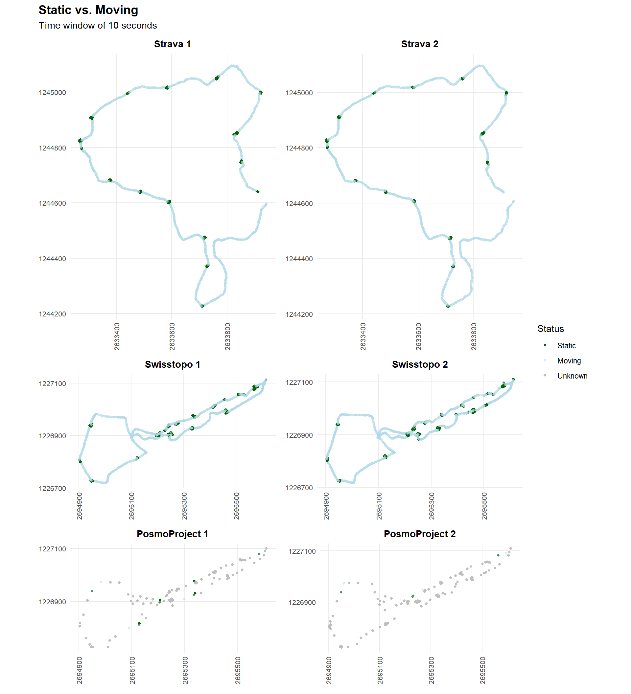
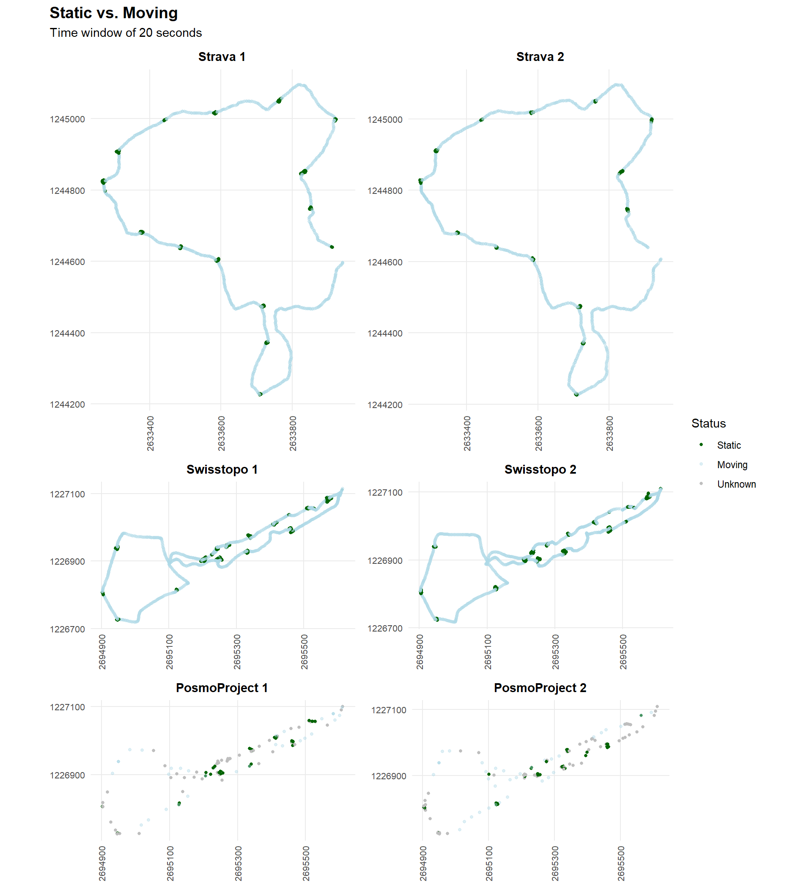
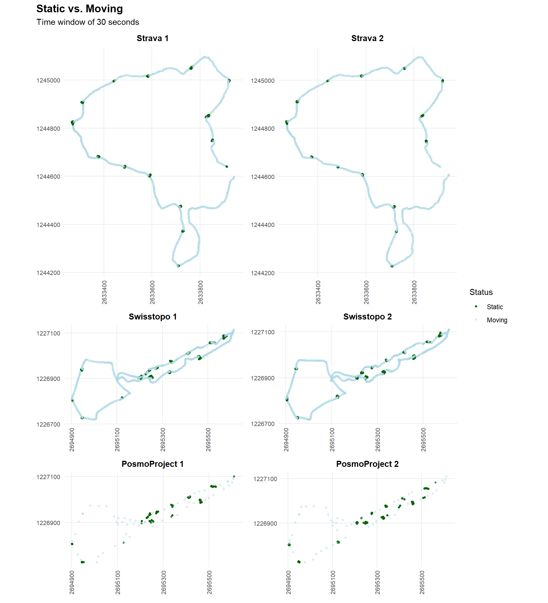
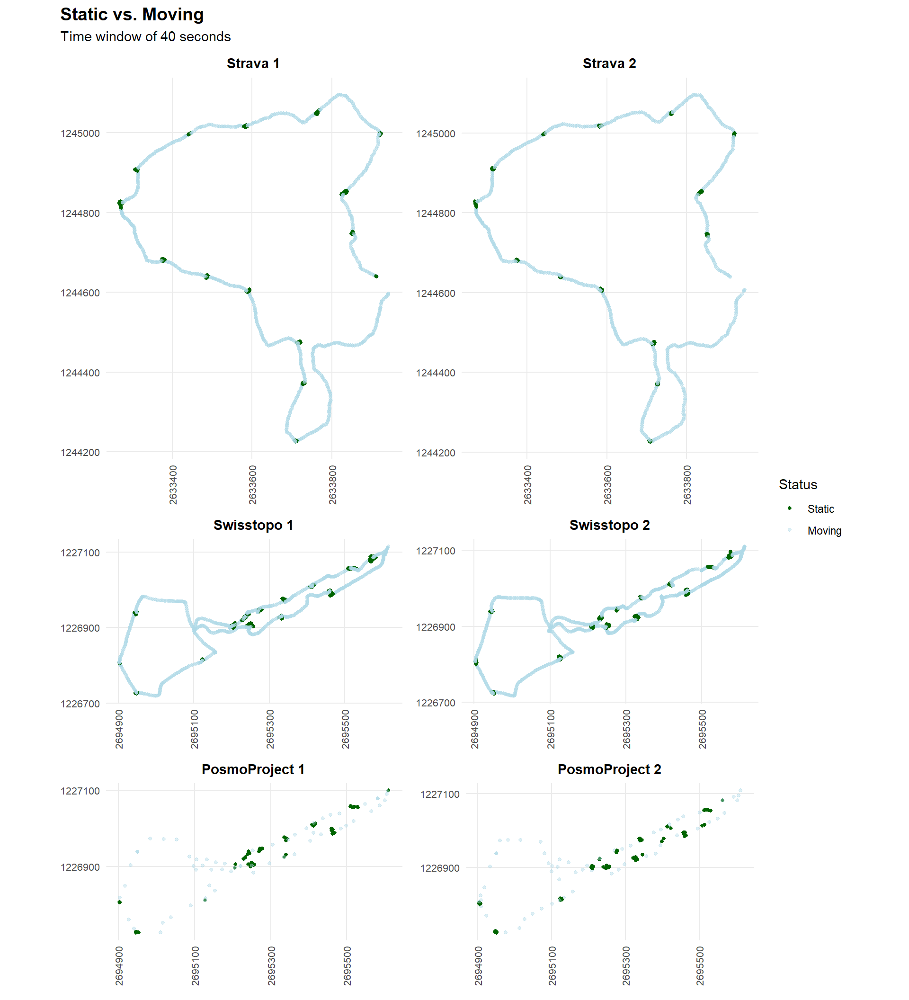
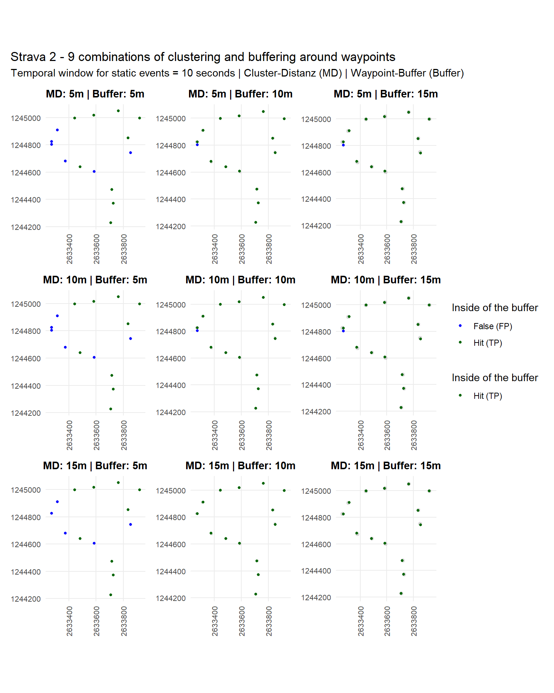
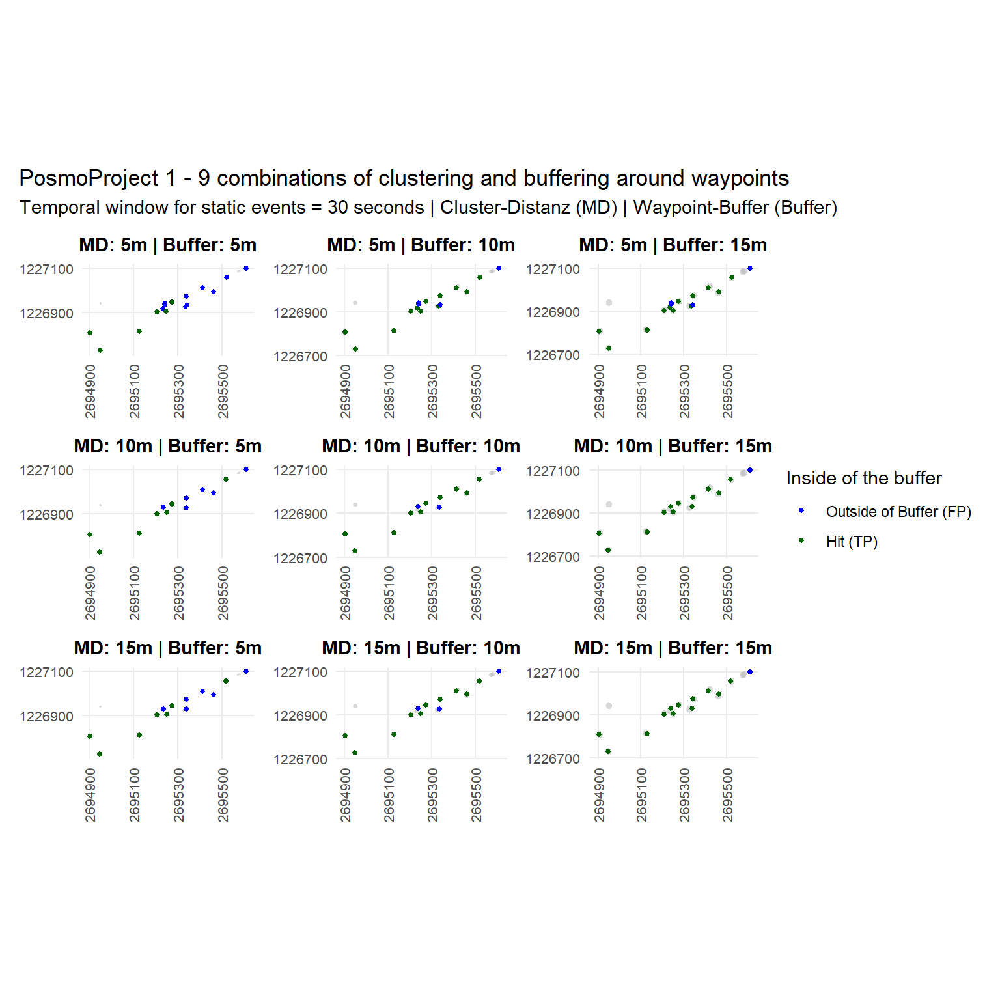
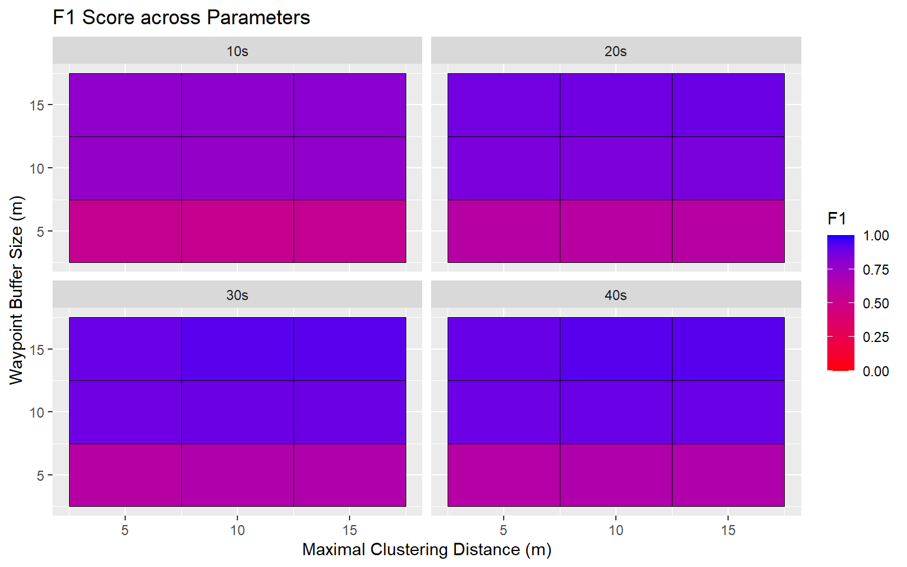
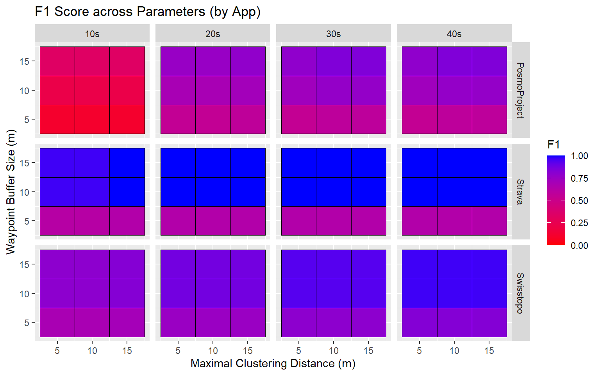

::: {.cell}

:::


::: {.cell}

```{#lst-cluster-buffer .r .cell-code  lst-cap="Methods" code-summary="Clustering and comparing to different buffers"}
library("sf")
library("dplyr")
library("units")
library("purrr")
library("slider")
library("ggplot2")
library("patchwork")
library("igraph")
library("kableExtra")
library("ggplot2")

# loading the cleand data with static events with different time windows (from preprocessing file)

# 10 Seconds Window
Strava_1_processed_10    <- st_read("datasets/cleaned/static/Strava_1_processed_10.gpkg", quiet = TRUE)
Strava_2_processed_10    <- st_read("datasets/cleaned/static/Strava_2_processed_10.gpkg", quiet = TRUE)
Swisstopo_1_processed_10 <- st_read("datasets/cleaned/static/Swisstopo_1_processed_10.gpkg", quiet = TRUE)
Swisstopo_2_processed_10 <- st_read("datasets/cleaned/static/Swisstopo_2_processed_10.gpkg", quiet = TRUE)
Posmo_1_processed_10     <- st_read("datasets/cleaned/static/Posmo_1_processed_10.gpkg", quiet = TRUE)
Posmo_2_processed_10     <- st_read("datasets/cleaned/static/Posmo_2_processed_10.gpkg", quiet = TRUE)

# 20 Seconds Window
Strava_1_processed_20    <- st_read("datasets/cleaned/static/Strava_1_processed_20.gpkg", quiet = TRUE)
Strava_2_processed_20    <- st_read("datasets/cleaned/static/Strava_2_processed_20.gpkg", quiet = TRUE)
Swisstopo_1_processed_20 <- st_read("datasets/cleaned/static/Swisstopo_1_processed_20.gpkg", quiet = TRUE)
Swisstopo_2_processed_20 <- st_read("datasets/cleaned/static/Swisstopo_2_processed_20.gpkg", quiet = TRUE)
Posmo_1_processed_20     <- st_read("datasets/cleaned/static/Posmo_1_processed_20.gpkg", quiet = TRUE)
Posmo_2_processed_20     <- st_read("datasets/cleaned/static/Posmo_2_processed_20.gpkg", quiet = TRUE)

# 30 Seconds Window
Strava_1_processed_30    <- st_read("datasets/cleaned/static/Strava_1_processed_30.gpkg", quiet = TRUE)
Strava_2_processed_30    <- st_read("datasets/cleaned/static/Strava_2_processed_30.gpkg", quiet = TRUE)
Swisstopo_1_processed_30 <- st_read("datasets/cleaned/static/Swisstopo_1_processed_30.gpkg", quiet = TRUE)
Swisstopo_2_processed_30 <- st_read("datasets/cleaned/static/Swisstopo_2_processed_30.gpkg", quiet = TRUE)
Posmo_1_processed_30     <- st_read("datasets/cleaned/static/Posmo_1_processed_30.gpkg", quiet = TRUE)
Posmo_2_processed_30     <- st_read("datasets/cleaned/static/Posmo_2_processed_30.gpkg", quiet = TRUE)

# 40 Seconds Window
Strava_1_processed_40    <- st_read("datasets/cleaned/static/Strava_1_processed_40.gpkg", quiet = TRUE)
Strava_2_processed_40    <- st_read("datasets/cleaned/static/Strava_2_processed_40.gpkg", quiet = TRUE)
Swisstopo_1_processed_40 <- st_read("datasets/cleaned/static/Swisstopo_1_processed_40.gpkg", quiet = TRUE)
Swisstopo_2_processed_40 <- st_read("datasets/cleaned/static/Swisstopo_2_processed_40.gpkg", quiet = TRUE)
Posmo_1_processed_40     <- st_read("datasets/cleaned/static/Posmo_1_processed_40.gpkg", quiet = TRUE)
Posmo_2_processed_40     <- st_read("datasets/cleaned/static/Posmo_2_processed_40.gpkg", quiet = TRUE)

# way points cleaned

wp_olten_clean    <- st_read("datasets/cleaned/Waypoints_Olten.gpkg", quiet = TRUE)
wp_wollerau_clean <- st_read("datasets/cleaned/Waypoints_Wollerau.gpkg", quiet = TRUE)

# clusters together points which are close together and compare them to the way point buffer

stops <- function(full_df, waypoints, max_dist_list, wp_buffer_list) {
  
  # only take static points
  static_only <- full_df |> 
    filter(is_static == TRUE)
  
  # Checks if there are no static points
  if (nrow(static_only) == 0) {
    return(st_as_sf(data.frame(geometry = st_sfc(), crs = st_crs(waypoints))))
  }
  
  all_results_list <- list()
  
  # cluster for each maximale distanz 
  for (md in max_dist_list) {
    
    # calculates distance matrix for all points
    # distance and adjacency matrix for the current max_dist (md)
    dist_matrix <- st_distance(static_only)
    adj_matrix <- dist_matrix <= set_units(md, "m")
    
    # give Cluster-IDs 
    g <- graph_from_adjacency_matrix(adj_matrix, mode = "undirected")
    static_only$cluster_id <- components(g)$membership
    
    # calculate centroids for specific max_dist
    current_centroids <- static_only |>
      group_by(cluster_id) |>
      summarise(.groups = "drop") |>
      st_centroid() |>
      mutate(max_dist_setting = md) # saves maximum distance at which this centroid was calculated
    
    # inner loop: For each buffer size around the waypoints
    for (buf_size in wp_buffer_list) {
      
      # calculate temporary buffer for the waypoints
      temp_buffer_df <- waypoints |>
        mutate(gt_id = row_number()) |>
        st_buffer(buf_size)
      
      intersect_list <- st_intersects(current_centroids, temp_buffer_df)
      
      # generate dynamic column names (e.g. in_buf_md10_b15)
      col_name_bool <- paste0("in_buf_md", md, "_b", buf_size)
      col_name_id   <- paste0("gt_id_md", md, "_b", buf_size)
      
      # Write the results as new columns in the temporary Centroid table
      current_centroids <- current_centroids |>
        mutate(
          !!col_name_bool := lengths(intersect_list) > 0,
          !!col_name_id   := sapply(intersect_list, function(x) if(length(x) > 0) temp_buffer_df$gt_id[x[1]] else NA)
        )
    }
    
    anchor_id_col <- paste0("gt_id_md", md, "_b", max(wp_buffer_list))
    
    hits   <- current_centroids |> filter(!is.na(.data[[anchor_id_col]]))
    misses <- current_centroids |> filter(is.na(.data[[anchor_id_col]]))
    
    if (nrow(hits) > 0) {
      # Build precise column tracking strings matching the loop state
      all_dynamic_cols <- c(
        paste0("in_buf_md", md, "_b", wp_buffer_list),
        paste0("gt_id_md", md, "_b", wp_buffer_list)
      )
      
      # combine multiple tracking dots in the same physical buffer down to 1 row
      hits_cleaned <- hits |>
        group_by(.data[[anchor_id_col]]) |>
        summarise(
          cluster_id       = min(cluster_id),
          max_dist_setting = min(max_dist_setting),
          # any_of safely skips any columns that were omitted
          across(any_of(all_dynamic_cols), ~ max(.x, na.rm = TRUE)),
          .groups          = "drop"
        ) |>
        st_centroid() # Re-compute single center geometry
      
      current_centroids <- bind_rows(hits_cleaned, misses)
    }
    
    # Save the interim result for this max_dist in our list.
    all_results_list[[as.character(md)]] <- current_centroids
  }
  
  # Combine all the partial results (for each max_dist) into one large table.
  final_df <- bind_rows(all_results_list)
  
  return(final_df)
}

# buffer size around way points
max_dist_liste <- c(5, 10, 15)
wp_buffer_liste <- c(5, 10, 15)

# add stops to 10 second windows

Strava_1_10_stops_list <- stops(Strava_1_processed_10, wp_olten_clean, max_dist = max_dist_liste, wp_buffer = wp_buffer_liste)
Strava_2_10_stops_list <- stops(Strava_2_processed_10, wp_olten_clean, max_dist = max_dist_liste, wp_buffer = wp_buffer_liste)
Swisstopo_1_10_stops_list <- stops(Swisstopo_1_processed_10, wp_wollerau_clean, max_dist = max_dist_liste, wp_buffer = wp_buffer_liste)
Swisstopo_2_10_stops_list <- stops(Swisstopo_2_processed_10, wp_wollerau_clean, max_dist = max_dist_liste, wp_buffer = wp_buffer_liste)
Posmo_1_10_stops_list <- stops(Posmo_1_processed_10, wp_wollerau_clean, max_dist = max_dist_liste, wp_buffer = wp_buffer_liste)
Posmo_2_10_stops_list <- stops(Posmo_2_processed_10, wp_wollerau_clean, max_dist = max_dist_liste, wp_buffer = wp_buffer_liste)

# add stops to 20 second windows

Strava_1_20_stops_list <- stops(Strava_1_processed_20, wp_olten_clean, max_dist = max_dist_liste, wp_buffer = wp_buffer_liste)
Strava_2_20_stops_list <- stops(Strava_2_processed_20, wp_olten_clean, max_dist = max_dist_liste, wp_buffer = wp_buffer_liste)
Swisstopo_1_20_stops_list <- stops(Swisstopo_1_processed_20, wp_wollerau_clean, max_dist = max_dist_liste, wp_buffer = wp_buffer_liste)
Swisstopo_2_20_stops_list <- stops(Swisstopo_2_processed_20, wp_wollerau_clean, max_dist = max_dist_liste, wp_buffer = wp_buffer_liste)
Posmo_1_20_stops_list <- stops(Posmo_1_processed_20, wp_wollerau_clean, max_dist = max_dist_liste, wp_buffer = wp_buffer_liste)
Posmo_2_20_stops_list <- stops(Posmo_2_processed_20, wp_wollerau_clean, max_dist = max_dist_liste, wp_buffer = wp_buffer_liste)

# add stops to 30 second windows

Strava_1_30_stops_list <- stops(Strava_1_processed_30, wp_olten_clean, max_dist = max_dist_liste, wp_buffer = wp_buffer_liste)
Strava_2_30_stops_list <- stops(Strava_2_processed_30, wp_olten_clean, max_dist = max_dist_liste, wp_buffer = wp_buffer_liste)
Swisstopo_1_30_stops_list <- stops(Swisstopo_1_processed_30, wp_wollerau_clean, max_dist = max_dist_liste, wp_buffer = wp_buffer_liste)
Swisstopo_2_30_stops_list <- stops(Swisstopo_2_processed_30, wp_wollerau_clean, max_dist = max_dist_liste, wp_buffer = wp_buffer_liste)
Posmo_1_30_stops_list <- stops(Posmo_1_processed_30, wp_wollerau_clean, max_dist = max_dist_liste, wp_buffer = wp_buffer_liste)
Posmo_2_30_stops_list <- stops(Posmo_2_processed_30, wp_wollerau_clean, max_dist = max_dist_liste, wp_buffer = wp_buffer_liste)

# add stops to 40 second windows

Strava_1_40_stops_list <- stops(Strava_1_processed_40, wp_olten_clean, max_dist = max_dist_liste, wp_buffer = wp_buffer_liste)
Strava_2_40_stops_list <- stops(Strava_2_processed_40, wp_olten_clean, max_dist = max_dist_liste, wp_buffer = wp_buffer_liste)
Swisstopo_1_40_stops_list <- stops(Swisstopo_1_processed_40, wp_wollerau_clean, max_dist = max_dist_liste, wp_buffer = wp_buffer_liste)
Swisstopo_2_40_stops_list <- stops(Swisstopo_2_processed_40, wp_wollerau_clean, max_dist = max_dist_liste, wp_buffer = wp_buffer_liste)
Posmo_1_40_stops_list <- stops(Posmo_1_processed_40, wp_wollerau_clean, max_dist = max_dist_liste, wp_buffer = wp_buffer_liste)
Posmo_2_40_stops_list <- stops(Posmo_2_processed_40, wp_wollerau_clean, max_dist = max_dist_liste, wp_buffer = wp_buffer_liste)
```
:::


## Abstract


## Introduction

The field of Computational Movement Analysis (CMA) has emerged in response to the growing volumes of tracking data. It helps to develop the tools which are necessary to extract meaningful patterns and behaviours from raw location data [@laube2014computational]. A significant part of this process is segmentation, which divides movement paths into segments, such as "stops" and "moves", in order to make the data easier to analyse and interpret [@laube2014computational].

This project investigates the effectiveness of the segmentation algorithm used by @laube2011 for detecting exercise stops along Vitaparcours tracks. In their article, @laube2011 used movement data from animals and removed the static segments, whereas this project aims to use exactly these static events for stop detection. 

A further significant challenge in movement analysis is what researchers call "Granularity Grief", where the results of the analysis are influenced by the temporal scale or sampling frequency of the tracking device [@laube2011]. This project aims to address this issue by comparing trajectories recorded by three different mobile apps (PosmoProject, Strava and Swisstopo). By evaluating how the different sampling regimes impact stop detection, the study aims to quantify the robustness of stop detection across variable data qualities.

### Reserch Questions

- Can Vitaparcours exercise stops be efficiently detected in movement data from different providers using the segmentation algorithm described in @laube2011?
- How well do modelled exercise stops match the real location of these stops for movement trajectories from different providers?
- How do the temporal windows used to determine static events, the clustering distances of static points to one stop and the buffer size around the ground truth waypoints influence detection accuracy?

## Material and Methods

### Data

The data for this project was collected using three different mobile apps (Strava, Swisstopo and PosmoProject) between the 20 and 24 May 2026. The Strava data was recorded on a Vitaparcours track in Olten, on two separate days. The data from Swisstopo and PosmoProject, on the other hand, was recorded on a track in Wollerau, at the same time and also on two different days. The Strava and Swisstopo apps recorded a fix every second, whereas the PosmoProject app did not record at a continuous interval. 
Ground truth points were also recorded with the Swisstopo app, because no Vitaparcours stops datasets could be found online. The track in Olten consists of 14 stops, while the track in Wollerau has 15.

### Preprocessing

Before any analysis can begin, the raw data needs to be pre-processed to make it comparable and easier to handle. For this project, the data from Strava, Swisstopo and PosmoProject were first imported, standardised and converted to the Europe/Zurich time zone. Furthermore, all coordinate geometries were transformed into the Swiss coordinate systems CH1903+/LV95, to ensure accurate calculations (***need to add link to Preprocessing file***). 

### Methods

#### Isolating Static Events

To isolate static events from the different trajectories, geometries were classified using an adaptive mean temporal window distance for four windows of different sizes (10, 20, 30 and 40 seconds), as described by @laube2011. For each point i, the algorithm calculated the neighbouring coordinates within the window ($[t_{i} - \frac{w}{2}, t_{i} + \frac{w}{2}]$) and computed their mean spatial distance (stepMean_i). The average of these spatial means was then used as a threshold to identify static points (is_static = TRUE), if stepMean_i was smaller than the threshold. The resulting 24 datasets were finally exported as GeoPackage files for further analysis (@fig-10-window, @fig-20-window, @fig-30-window and @fig-40-window). These processes were carried out in the preprocessing file, as they were computationally very heavy (***need to add Link to Preprocessing file***).

#### Clustering Static Events and Comparing them to Different Buffers 

To identify and analyse individual stationary events (stops) across different tracking datasets, a spatial analysis workflow was implemented at multiple scales (@lst-cluster-buffer). This customised R function first filters static data points and applies a clustering mechanism based on distance, creating one stop from multiple static fixes. Points within a maximum distance threshold of 5, 10 or 15 metres are grouped together and their respective geometric centroids are calculated to produce one stop per cluster.

Furthermore, a distance analysis evaluates these centroids against the ground truth waypoint locations. Multiple distance buffers (5, 10 and 15 metres) are then generated around the waypoints, in order to identify spatial intersections between the ground truth stop buffers and the generated stops. To avoid having multiple stops and thus multiple true positives, per buffer, the stops are further filtered. Multiple classified stops within the buffers are combined into a single stop inside a buffer, using the centroid. This ensures data consistency and simplifies data analysis and interpretation.

This workflow dynamically tracks spatial attributes across different parameter combinations and generates structured, spatial data frames. To further assess temporal sensitivity, the entire analysis was repeated using the preprocessed datasets, segmented with four distinct temporal windows to capture static events. This ensures a robust evaluation of spatial clustering behaviour across varying spatial and temporal scales.

#### Performance Metrics (Precision, Recall and F1-score)

In the following, precision, recall and the F1-score are used to evaluate the classification performance of the stop detection. These concepts are closely connected to the concepts of Error of Omission (EOO) and Error of Commission (EOC), concepts used in movement pattern analysis [@laube2014computational]. EOO, also known as false negative (FN), refers to "missed patterns", in our case ground truth patterns that the algorithm failed to identify. EOC, or false positives (FP), on the other hand, refer to instances where a pattern is identified even though none actually exists.

While precision ($\frac{TP}{TP+FP}$) measures the proportion of predicted stops that are correct, recall ($\frac{TP}{TP+FN}$) indicates whether all ground truth stops were identified [@powers2011evaluation]. The closer these parameter values are to 1, the more accurate the method. The F1-score ($2 \times \frac{\text{Precision} \times \text{Recall}}{\text{Precision} + \text{Recall}}$), combines both parameters to provide a single value between 0 and 1.The closer the F1-score value is to 1, the more accurate the method is [@powers2011evaluation]. 

#### Use of AI

This project was carried out with the help of artificial intelligence (AI) tools. Google Gemini was used as an analytical and exploratory tool to assist with searching for scientific literature, generating parts of the data analysis code and interpreting the results. Additionally, DeepL Write was also utilised as a phrasing and stylistic aid to improve the linguistic clarity and quality of the written text. All AI-generated outputs, code blocks and insights were critically evaluated, verified and manually refined to ensure academic integrity and factual accuracy and to guarantee that the work remains an independent achievement. The specific tools used and their precise applications are detailed in the "Directory of AI Tools Used" at the end of this document.

## Results

@fig-10-window, @fig-20-window, @fig-30-window and @fig-40-window show the results of the static event identification for the four temporal windows of 10, 20, 30 and 40 seconds. Because the PosmoProject data was not captured in a continuous interval, no neighbouring fixes were detected for some fixes in the 10 and 20 seconds temporal windows. These points are plotted as "Unknown" and cannot be used for further analysis. 


::: {.cell}

```{.r .cell-code}
# Plot the static events

olten_y <- seq(1244200, 1245100, by = 200)
olten_x <- seq(2633200, 2634000, by = 200)

wollerau_y <- seq(1226700, 1227200, by = 200)
wollerau_x <- seq(2694900, 2695700, by = 200)

base_theme <- list(
  theme_minimal(),
  theme(
    axis.text.x = element_text(angle = 90, vjust = 0.5, hjust = 0.5, size = 8),
    axis.text.y = element_text(size = 8),
    plot.title = element_text(size = 11, face = "bold", hjust = 0.5),
    panel.grid.minor = element_blank() # Removes messy minor gridlines
  )
)

# hide legend for the first 5 plots to prevent duplicates
hide_legend <- scale_color_manual(
  values = c("TRUE" = "darkgreen", "FALSE" = "#ADD8E666"),
  na.value = "grey",
  guide = "none"
)

# show full legend on the very last plot, forcing all 3 colors to display
show_full_legend <- scale_color_manual(
  values = c("TRUE" = "darkgreen", "FALSE" = "#ADD8E666"),
  na.value = "grey",
  limits = c(TRUE, FALSE, NA), # <--- Keep this order
  labels = c("Static", "Moving", "Unknown"), # <--- Match the order of limits exactly without names
  name = "Status"
)

p1 <- ggplot(Strava_1_processed_10 ) +
  geom_sf(aes(color = is_static), size = 1) +
  hide_legend +
  labs(title = "Strava 1") +
  scale_x_continuous(breaks = olten_x) + 
  scale_y_continuous(breaks = olten_y) +
  coord_sf(datum = 2056) + 
  base_theme

p2 <- ggplot(Strava_2_processed_10) +
  geom_sf(aes(color = is_static), size = 1) +
  hide_legend +
  labs(title = "Strava 2") +
  scale_x_continuous(breaks = olten_x) + 
  scale_y_continuous(breaks = olten_y) +
  coord_sf(datum = 2056) + 
  base_theme

p3 <- ggplot(Swisstopo_1_processed_10) +
  geom_sf(aes(color = is_static), size = 1) +
  hide_legend +
  labs(title = "Swisstopo 1") +
  scale_x_continuous(breaks = wollerau_x) + 
  scale_y_continuous(breaks = wollerau_y) +
  coord_sf(datum = 2056) + 
  base_theme

p4 <- ggplot(Swisstopo_2_processed_10) +
  geom_sf(aes(color = is_static), size = 1) +
  hide_legend +
  labs(title = "Swisstopo 2") +
  scale_x_continuous(breaks = wollerau_x) + 
  scale_y_continuous(breaks = wollerau_y) +
  coord_sf(datum = 2056) + 
  base_theme

p5 <- ggplot(Posmo_1_processed_10) +
  geom_sf(aes(color = is_static), size = 1) +
  hide_legend +
  labs(title = "PosmoProject 1") +
  scale_x_continuous(breaks = wollerau_x) + 
  scale_y_continuous(breaks = wollerau_y) +
  coord_sf(datum = 2056) + 
  base_theme

p6 <- ggplot(Posmo_2_processed_10) +
  geom_sf(aes(color = is_static), size = 1) +
  show_full_legend +
  labs(title = "PosmoProject 2") +
  scale_x_continuous(breaks = wollerau_x) + 
  scale_y_continuous(breaks = wollerau_y) +
  coord_sf(datum = 2056) + 
  base_theme

# creates a grid layout with 3 columns, and collects the legends into one clean spot
p1 + p2 + p3 + p4 + p5 + p6 + 
  plot_layout(ncol = 2, guides = "collect") +
  plot_annotation(
    title = "Static vs. Moving",
    subtitle = "Time window of 10 seconds",
    theme = theme(plot.title = element_text(face = "bold", size = 14))
  ) 
```

::: {.cell-output-display}
{#fig-10-window width=960}
:::
:::


::: {.cell}

```{.r .cell-code}
# Plot the static events

olten_y <- seq(1244200, 1245100, by = 200)
olten_x <- seq(2633200, 2634000, by = 200)

wollerau_y <- seq(1226700, 1227200, by = 200)
wollerau_x <- seq(2694900, 2695700, by = 200)

base_theme <- list(
  theme_minimal(),
  theme(
    axis.text.x = element_text(angle = 90, vjust = 0.5, hjust = 0.5, size = 8),
    axis.text.y = element_text(size = 8),
    plot.title = element_text(size = 11, face = "bold", hjust = 0.5),
    panel.grid.minor = element_blank() # Removes messy minor gridlines
  )
)

# hide legend for the first 5 plots to prevent duplicates
hide_legend <- scale_color_manual(
  values = c("TRUE" = "darkgreen", "FALSE" = "#ADD8E666"),
  na.value = "grey",
  guide = "none"
)

# show full legend on the very last plot, forcing all 3 colors to display
show_full_legend <- scale_color_manual(
  values = c("TRUE" = "darkgreen", "FALSE" = "#ADD8E666"),
  na.value = "grey",
  limits = c(TRUE, FALSE, NA), # <--- Keep this order
  labels = c("Static", "Moving", "Unknown"), # <--- Match the order of limits exactly without names
  name = "Status"
)

p1 <- ggplot(Strava_1_processed_20 ) +
  geom_sf(aes(color = is_static), size = 1) +
  hide_legend +
  labs(title = "Strava 1") +
  scale_x_continuous(breaks = olten_x) + 
  scale_y_continuous(breaks = olten_y) +
  coord_sf(datum = 2056) + 
  base_theme

p2 <- ggplot(Strava_2_processed_20) +
  geom_sf(aes(color = is_static), size = 1) +
  hide_legend +
  labs(title = "Strava 2") +
  scale_x_continuous(breaks = olten_x) + 
  scale_y_continuous(breaks = olten_y) +
  coord_sf(datum = 2056) + 
  base_theme

p3 <- ggplot(Swisstopo_1_processed_20) +
  geom_sf(aes(color = is_static), size = 1) +
  hide_legend +
  labs(title = "Swisstopo 1") +
  scale_x_continuous(breaks = wollerau_x) + 
  scale_y_continuous(breaks = wollerau_y) +
  coord_sf(datum = 2056) + 
  base_theme

p4 <- ggplot(Swisstopo_2_processed_20) +
  geom_sf(aes(color = is_static), size = 1) +
  hide_legend +
  labs(title = "Swisstopo 2") +
  scale_x_continuous(breaks = wollerau_x) + 
  scale_y_continuous(breaks = wollerau_y) +
  coord_sf(datum = 2056) + 
  base_theme

p5 <- ggplot(Posmo_1_processed_20) +
  geom_sf(aes(color = is_static), size = 1) +
  hide_legend +
  labs(title = "PosmoProject 1") +
  scale_x_continuous(breaks = wollerau_x) + 
  scale_y_continuous(breaks = wollerau_y) +
  coord_sf(datum = 2056) + 
  base_theme

p6 <- ggplot(Posmo_2_processed_20) +
  geom_sf(aes(color = is_static), size = 1) +
  show_full_legend +
  labs(title = "PosmoProject 2") +
  scale_x_continuous(breaks = wollerau_x) + 
  scale_y_continuous(breaks = wollerau_y) +
  coord_sf(datum = 2056) + 
  base_theme

# creates a grid layout with 3 columns, and collects the legends into one clean spot
p1 + p2 + p3 + p4 + p5 + p6 + 
  plot_layout(ncol = 2, guides = "collect") +
  plot_annotation(
    title = "Static vs. Moving",
    subtitle = "Time window of 20 seconds",
    theme = theme(plot.title = element_text(face = "bold", size = 14))
  ) 
```

::: {.cell-output-display}
{#fig-20-window width=960}
:::
:::


::: {.cell}

```{.r .cell-code}
# Plot the static events

olten_y <- seq(1244200, 1245100, by = 200)
olten_x <- seq(2633200, 2634000, by = 200)

wollerau_y <- seq(1226700, 1227200, by = 200)
wollerau_x <- seq(2694900, 2695700, by = 200)

base_theme <- list(
  theme_minimal(),
  theme(
    axis.text.x = element_text(angle = 90, vjust = 0.5, hjust = 0.5, size = 8),
    axis.text.y = element_text(size = 8),
    plot.title = element_text(size = 11, face = "bold", hjust = 0.5),
    panel.grid.minor = element_blank() # Removes messy minor gridlines
  )
)

# hide legend for the first 5 plots to prevent duplicates
hide_legend <- scale_color_manual(
  values = c("TRUE" = "darkgreen", "FALSE" = "#ADD8E666"),
  guide = "none"
)

# show full legend on the very last plot, forcing all 3 colors to display
show_full_legend <- scale_color_manual(
  values = c("TRUE" = "darkgreen", "FALSE" = "#ADD8E666"),
  limits = c(TRUE, FALSE), # <--- Keep this order
  labels = c("Static", "Moving"), # <--- Match the order of limits exactly without names
  name = "Status"
)

p1 <- ggplot(Strava_1_processed_30 ) +
  geom_sf(aes(color = is_static), size = 1) +
  hide_legend +
  labs(title = "Strava 1") +
  scale_x_continuous(breaks = olten_x) + 
  scale_y_continuous(breaks = olten_y) +
  coord_sf(datum = 2056) + 
  base_theme

p2 <- ggplot(Strava_2_processed_30) +
  geom_sf(aes(color = is_static), size = 1) +
  hide_legend +
  labs(title = "Strava 2") +
  scale_x_continuous(breaks = olten_x) + 
  scale_y_continuous(breaks = olten_y) +
  coord_sf(datum = 2056) + 
  base_theme

p3 <- ggplot(Swisstopo_1_processed_30) +
  geom_sf(aes(color = is_static), size = 1) +
  hide_legend +
  labs(title = "Swisstopo 1") +
  scale_x_continuous(breaks = wollerau_x) + 
  scale_y_continuous(breaks = wollerau_y) +
  coord_sf(datum = 2056) + 
  base_theme

p4 <- ggplot(Swisstopo_2_processed_30) +
  geom_sf(aes(color = is_static), size = 1) +
  hide_legend +
  labs(title = "Swisstopo 2") +
  scale_x_continuous(breaks = wollerau_x) + 
  scale_y_continuous(breaks = wollerau_y) +
  coord_sf(datum = 2056) + 
  base_theme

p5 <- ggplot(Posmo_1_processed_30) +
  geom_sf(aes(color = is_static), size = 1) +
  hide_legend +
  labs(title = "PosmoProject 1") +
  scale_x_continuous(breaks = wollerau_x) + 
  scale_y_continuous(breaks = wollerau_y) +
  coord_sf(datum = 2056) + 
  base_theme

p6 <- ggplot(Posmo_2_processed_30) +
  geom_sf(aes(color = is_static), size = 1) +
  show_full_legend +
  labs(title = "PosmoProject 2") +
  scale_x_continuous(breaks = wollerau_x) + 
  scale_y_continuous(breaks = wollerau_y) +
  coord_sf(datum = 2056) + 
  base_theme

# creates a grid layout with 3 columns, and collects the legends into one clean spot
p1 + p2 + p3 + p4 + p5 + p6 + 
  plot_layout(ncol = 2, guides = "collect") +
  plot_annotation(
    title = "Static vs. Moving",
    subtitle = "Time window of 30 seconds",
    theme = theme(plot.title = element_text(face = "bold", size = 14))
  ) 
```

::: {.cell-output-display}
{#fig-30-window width=960}
:::
:::


::: {.cell}

```{.r .cell-code}
# Plot the static events

olten_y <- seq(1244200, 1245100, by = 200)
olten_x <- seq(2633200, 2634000, by = 200)

wollerau_y <- seq(1226700, 1227200, by = 200)
wollerau_x <- seq(2694900, 2695700, by = 200)

base_theme <- list(
  theme_minimal(),
  theme(
    axis.text.x = element_text(angle = 90, vjust = 0.5, hjust = 0.5, size = 8),
    axis.text.y = element_text(size = 8),
    plot.title = element_text(size = 11, face = "bold", hjust = 0.5),
    panel.grid.minor = element_blank() # Removes messy minor gridlines
  )
)

# hide legend for the first 5 plots to prevent duplicates
hide_legend <- scale_color_manual(
  values = c("TRUE" = "darkgreen", "FALSE" = "#ADD8E666"),
  guide = "none"
)

# show full legend on the very last plot, forcing all 3 colors to display
show_full_legend <- scale_color_manual(
  values = c("TRUE" = "darkgreen", "FALSE" = "#ADD8E666"),
  limits = c(TRUE, FALSE), # <--- Keep this order
  labels = c("Static", "Moving"), # <--- Match the order of limits exactly without names
  name = "Status"
)

p1 <- ggplot(Strava_1_processed_40 ) +
  geom_sf(aes(color = is_static), size = 1) +
  hide_legend +
  labs(title = "Strava 1") +
  scale_x_continuous(breaks = olten_x) + 
  scale_y_continuous(breaks = olten_y) +
  coord_sf(datum = 2056) + 
  base_theme

p2 <- ggplot(Strava_2_processed_40) +
  geom_sf(aes(color = is_static), size = 1) +
  hide_legend +
  labs(title = "Strava 2") +
  scale_x_continuous(breaks = olten_x) + 
  scale_y_continuous(breaks = olten_y) +
  coord_sf(datum = 2056) + 
  base_theme

p3 <- ggplot(Swisstopo_1_processed_40) +
  geom_sf(aes(color = is_static), size = 1) +
  hide_legend +
  labs(title = "Swisstopo 1") +
  scale_x_continuous(breaks = wollerau_x) + 
  scale_y_continuous(breaks = wollerau_y) +
  coord_sf(datum = 2056) + 
  base_theme

p4 <- ggplot(Swisstopo_2_processed_40) +
  geom_sf(aes(color = is_static), size = 1) +
  hide_legend +
  labs(title = "Swisstopo 2") +
  scale_x_continuous(breaks = wollerau_x) + 
  scale_y_continuous(breaks = wollerau_y) +
  coord_sf(datum = 2056) + 
  base_theme

p5 <- ggplot(Posmo_1_processed_40) +
  geom_sf(aes(color = is_static), size = 1) +
  hide_legend +
  labs(title = "PosmoProject 1") +
  scale_x_continuous(breaks = wollerau_x) + 
  scale_y_continuous(breaks = wollerau_y) +
  coord_sf(datum = 2056) + 
  base_theme

p6 <- ggplot(Posmo_2_processed_40) +
  geom_sf(aes(color = is_static), size = 1) +
  show_full_legend +
  labs(title = "PosmoProject 2") +
  scale_x_continuous(breaks = wollerau_x) + 
  scale_y_continuous(breaks = wollerau_y) +
  coord_sf(datum = 2056) + 
  base_theme

# creates a grid layout with 3 columns, and collects the legends into one clean spot
p1 + p2 + p3 + p4 + p5 + p6 + 
  plot_layout(ncol = 2, guides = "collect") +
  plot_annotation(
    title = "Static vs. Moving",
    subtitle = "Time window of 40 seconds",
    theme = theme(plot.title = element_text(face = "bold", size = 14))
  ) 
```

::: {.cell-output-display}
{#fig-40-window width=960}
:::
:::


@fig-10s-strava2 and @fig-30s-posmo1 illustrate two examples of visualised stop detection, for varying time windows, mobile apps, buffer sizes and cluster distances, for static events. 


::: {.cell}

```{.r .cell-code}
# plot the combinations of clustering and buffering around waypoint

olten_y <- seq(1244200, 1245100, by = 200)
olten_x <- seq(2633200, 2634000, by = 200)

base_theme <- list(
  theme_minimal(),
  theme(
    axis.text.x = element_text(angle = 90, vjust = 0.5, hjust = 0.5, size = 8),
    axis.text.y = element_text(size = 8),
    plot.title = element_text(size = 11, face = "bold", hjust = 0.5),
    panel.grid.minor = element_blank() # Removes messy minor gridlines
  )
)

plot_liste <- list()

for (md in max_dist_liste) {
  
  filtered <- Strava_2_10_stops_list |> 
    filter(max_dist_setting == md)
  
  for (buf in wp_buffer_liste) {
    
    current_col <- paste0("in_buf_md", md, "_b", buf)
    
    p <- ggplot() +
      geom_sf(data = st_buffer(wp_olten_clean, buf), 
              fill = "gray70", 
              alpha = 0.50, 
              color = NA) +
      geom_sf(data = filtered, 
              aes(color = as.character(.data[[current_col]])), 
              size = 1) +
      scale_color_manual(
        values = c("1" = "darkgreen", "0" = "blue"),
        labels = c("1" = "Hit (TP)", "0" = "False (FP)"),
        drop = FALSE
      ) +
      labs(title = paste0("MD: ", md, "m | Buffer: ", buf, "m"), 
           color = "Inside of the buffer") +
      scale_x_continuous(breaks = olten_x) +
      scale_y_continuous(breaks = olten_y) +
      coord_sf(datum = 2056) +
      base_theme
    
    plot_liste[[paste0("md", md, "_b", buf)]] <- p
  }
}

wrap_plots(plot_liste, ncol = 3) + 
  plot_layout(guides = "collect") + 
  plot_annotation(
    title = "Strava 2 - 9 combinations of clustering and buffering around waypoints",
    subtitle = "Temporal window for static events = 10 seconds | Cluster-Distanz (MD) | Waypoint-Buffer (Buffer)"
  )
```

::: {.cell-output-display}
{#fig-10s-strava2 width=768}
:::
:::


::: {.cell}

```{.r .cell-code}
# plot the combinations of clustering and buffering around waypoint

olten_y <- seq(1244200, 1245100, by = 200)
olten_x <- seq(2633200, 2634000, by = 200)

base_theme <- list(
  theme_minimal(),
  theme(
    axis.text.x = element_text(angle = 90, vjust = 0.5, hjust = 0.5, size = 8),
    axis.text.y = element_text(size = 8),
    plot.title = element_text(size = 11, face = "bold", hjust = 0.5),
    panel.grid.minor = element_blank() # Removes messy minor gridlines
  )
)

plot_liste <- list()

for (md in max_dist_liste) {
  
  filtered <- Posmo_1_30_stops_list |> 
    filter(max_dist_setting == md)
  
  for (buf in wp_buffer_liste) {
    
    current_col <- paste0("in_buf_md", md, "_b", buf)
    
    p <- ggplot() +
      geom_sf(data = st_buffer(wp_wollerau_clean, buf), 
              fill = "gray70", 
              alpha = 0.50, 
              color = NA) +
      geom_sf(data = filtered, 
              aes(color = as.character(.data[[current_col]])), 
              size = 1) +
      scale_color_manual(
        values = c("1" = "darkgreen", "0" = "blue"),
        labels = c("1" = "Hit (TP)", "0" = "Outside of Buffer (FP)"),
        drop = FALSE
      ) +
      labs(title = paste0("MD: ", md, "m | Buffer: ", buf, "m"), 
           color = "Inside of the buffer") +
      scale_x_continuous(breaks = wollerau_x) +
      scale_y_continuous(breaks = wollerau_y) +
      coord_sf(datum = 2056) +
      base_theme
    
    plot_liste[[paste0("md", md, "_b", buf)]] <- p
  }
}

wrap_plots(plot_liste, ncol = 3) + 
  plot_layout(guides = "collect") + 
  plot_annotation(
    title = "PosmoProject 1 - 9 combinations of clustering and buffering around waypoints",
    subtitle = "Temporal window for static events = 30 seconds | Cluster-Distanz (MD) | Waypoint-Buffer (Buffer)"
  )
```

::: {.cell-output-display}
{#fig-30s-posmo1 width=768}
:::
:::


To compare the effectiveness of using different time windows to classify static events and various clustering distances to create single stops, as well as different buffers around the waypoints, @tbl-parameters-all-prov compares the performance of the different parameters for all three mobile apps together. For each parameter combination, the table shows the total number of stops created (Total Stops Found), the number of stops correctly identified inside the buffer (True Positive), the number of stops identified outside of the buffer (False Positive) and the number of buffers for which no stops were detected (False Negative). 
Furthermore, the table shows the performance metrics precision and recall, with recall used to highlight the five best (green) and five worst (red) performances. 

Overall, 5 metre waypoint buffers detected the fewest stops inside the buffers and performed the worst. Waypoint buffers of 15 metres in connection with large temporal windows performed best in terms of detecting true stops and having few false stops. 


::: {#tbl-parameters-all-prov .cell tbl-cap='Parameter Table evaluating out of maximum 88 possible ground truth waypoint targets across all combined tracking apps. The top 5 performing rows for recall values are highlighted in green and the bottom 5 in red.'}

```{.r .cell-code}
# helper functions for dynamic column evaluation
extract_sum <- function(df, md, buf, val) {
  col_name <- paste0("in_buf_md", md, "_b", buf)
  if (!col_name %in% colnames(df)) return(0)
  sum(df[[col_name]] == val, na.rm = TRUE)
}

# function to process a dataset
get_all_permutations <- function(df, app_name, track_id, window_sec, total_gt) {
  if (nrow(df) == 0) return(data.frame())
  distances <- c(5, 10, 15)
  buffers   <- c(5, 10, 15)
  param_grid <- expand.grid(Max_Dist = distances, WP_Buffer = buffers)
  
  map_dfr(1:nrow(param_grid), function(i) {
    md  <- param_grid$Max_Dist[i]
    buf <- param_grid$WP_Buffer[i]
    df_sub <- df |> 
      filter(max_dist_setting == md)
    
    if (nrow(df_sub) == 0) return(data.frame())
    
    data.frame(
      App         = app_name,
      Track       = track_id,
      Window      = paste0(window_sec, "s"),
      Max_Dist    = md,
      WP_Buffer   = buf,
      Total_Stops = nrow(df_sub),
      True_Pos    = extract_sum(df_sub, md, buf, TRUE),
      False_Pos   = extract_sum(df_sub, md, buf, FALSE),
      Total_GT    = total_gt
    )
  })
}

# explicit ground truth variables
gt_strava_t1 <- nrow(wp_olten_clean)    # 14
gt_strava_t2 <- nrow(wp_olten_clean)    # 14
gt_swiss_t1  <- nrow(wp_wollerau_clean) # 15
gt_swiss_t2  <- nrow(wp_wollerau_clean) # 15
gt_posmo_t1  <- nrow(wp_wollerau_clean) # 15
gt_posmo_t2  <- nrow(wp_wollerau_clean) # 15

# maximum possible waypoints to detect across all 6 tracks combined
MAX_GLOBAL_GT <- (14 * 2) + (15 * 4) 

# run calculations over the 24 clean datasets
master_raw_metrics <- bind_rows(
  get_all_permutations(Strava_1_10_stops_list, "Strava", "T1", 10, gt_strava_t1),
  get_all_permutations(Strava_2_10_stops_list, "Strava", "T2", 10, gt_strava_t2),
  get_all_permutations(Swisstopo_1_10_stops_list, "Swisstopo", "T1", 10, gt_swiss_t1),
  get_all_permutations(Swisstopo_2_10_stops_list, "Swisstopo", "T2", 10, gt_swiss_t2),
  get_all_permutations(Posmo_1_10_stops_list, "PosmoProject", "T1", 10, gt_posmo_t1),
  get_all_permutations(Posmo_2_10_stops_list, "PosmoProject", "T2", 10, gt_posmo_t2),
  
  get_all_permutations(Strava_1_20_stops_list, "Strava", "T1", 20, gt_strava_t1),
  get_all_permutations(Strava_2_20_stops_list, "Strava", "T2", 20, gt_strava_t2),
  get_all_permutations(Swisstopo_1_20_stops_list, "Swisstopo", "T1", 20, gt_swiss_t1),
  get_all_permutations(Swisstopo_2_20_stops_list, "Swisstopo", "T2", 20, gt_swiss_t2),
  get_all_permutations(Posmo_1_20_stops_list, "PosmoProject", "T1", 20, gt_posmo_t1),
  get_all_permutations(Posmo_2_20_stops_list, "PosmoProject", "T2", 20, gt_posmo_t2),
  
  get_all_permutations(Strava_1_30_stops_list, "Strava", "T1", 30, gt_strava_t1),
  get_all_permutations(Strava_2_30_stops_list, "Strava", "T2", 30, gt_strava_t2),
  get_all_permutations(Swisstopo_1_30_stops_list, "Swisstopo", "T1", 30, gt_swiss_t1),
  get_all_permutations(Swisstopo_2_30_stops_list, "Swisstopo", "T2", 30, gt_swiss_t2),
  get_all_permutations(Posmo_1_30_stops_list, "PosmoProject", "T1", 30, gt_posmo_t1),
  get_all_permutations(Posmo_2_30_stops_list, "PosmoProject", "T2", 30, gt_posmo_t2),
  
  get_all_permutations(Strava_1_40_stops_list, "Strava", "T1", 40, gt_strava_t1),
  get_all_permutations(Strava_2_40_stops_list, "Strava", "T2", 40, gt_strava_t2),
  get_all_permutations(Swisstopo_1_40_stops_list, "Swisstopo", "T1", 40, gt_swiss_t1),
  get_all_permutations(Swisstopo_2_40_stops_list, "Swisstopo", "T2", 40, gt_swiss_t2),
  get_all_permutations(Posmo_1_40_stops_list, "PosmoProject", "T1", 40, gt_posmo_t1),
  get_all_permutations(Posmo_2_40_stops_list, "PosmoProject", "T2", 40, gt_posmo_t2)
)

# corrected mathematical aggregation
global_parameter_table <- master_raw_metrics |>
  group_by(Window, Max_Dist, WP_Buffer) |>
  summarise(
    Total_Stops_Found  = sum(Total_Stops),
    True_Positives     = sum(True_Pos),
    False_Positives    = sum(False_Pos),
    
    # False Negatives = Total available ground truth points (88) minus the ones we successfully hit
    False_Negatives    = MAX_GLOBAL_GT - True_Positives,
    
    # Precision and recall 
    Detection_Precision = round((True_Positives / (True_Positives + False_Positives)) * 100, 1),
    Detection_Recall = round((True_Positives / MAX_GLOBAL_GT) * 100, 1),
    .groups = "drop"
  ) |>
  arrange(Window, Max_Dist, WP_Buffer)

# rank performances
ranked_indices <- global_parameter_table |>
  mutate(row_id = row_number()) |>
  arrange(desc(Detection_Recall), False_Positives)

top_5_rows    <- head(ranked_indices$row_id, 5)
bottom_5_rows <- tail(ranked_indices$row_id, 5)

# render table
global_parameter_table |>
  select(Window, Max_Dist, WP_Buffer, Total_Stops_Found, True_Positives, False_Positives, False_Negatives, Detection_Precision, Detection_Recall) |>
  knitr::kable(
    format = "html",
    col.names = c("Time Window", "Maximal Clustering Distance (m)", "Waypoint Buffer (m)", "Total Stops Found", "True Positives (TP)", "False Positives (FP)", "False Negatives (FN)", "Precision (%)", "Recall (%)")
  ) |>
  kable_styling(bootstrap_options = c("striped", "hover", "condensed")) |>
  row_spec(top_5_rows, background = "#d4edda", extra_css = "font-weight: bold; color: #155724;") |>
  row_spec(bottom_5_rows, background = "#f8d7da", extra_css = "color: #721c24;")
```

::: {.cell-output-display}
`````{=html}
<table class="table table-striped table-hover table-condensed" style="margin-left: auto; margin-right: auto;">
 <thead>
  <tr>
   <th style="text-align:left;"> Time Window </th>
   <th style="text-align:right;"> Maximal Clustering Distance (m) </th>
   <th style="text-align:right;"> Waypoint Buffer (m) </th>
   <th style="text-align:right;"> Total Stops Found </th>
   <th style="text-align:right;"> True Positives (TP) </th>
   <th style="text-align:right;"> False Positives (FP) </th>
   <th style="text-align:right;"> False Negatives (FN) </th>
   <th style="text-align:right;"> Precision (%) </th>
   <th style="text-align:right;"> Recall (%) </th>
  </tr>
 </thead>
<tbody>
  <tr>
   <td style="text-align:left;background-color: rgba(248, 215, 218, 255) !important;color: #721c24;"> 10s </td>
   <td style="text-align:right;background-color: rgba(248, 215, 218, 255) !important;color: #721c24;"> 5 </td>
   <td style="text-align:right;background-color: rgba(248, 215, 218, 255) !important;color: #721c24;"> 5 </td>
   <td style="text-align:right;background-color: rgba(248, 215, 218, 255) !important;color: #721c24;"> 80 </td>
   <td style="text-align:right;background-color: rgba(248, 215, 218, 255) !important;color: #721c24;"> 45 </td>
   <td style="text-align:right;background-color: rgba(248, 215, 218, 255) !important;color: #721c24;"> 35 </td>
   <td style="text-align:right;background-color: rgba(248, 215, 218, 255) !important;color: #721c24;"> 43 </td>
   <td style="text-align:right;background-color: rgba(248, 215, 218, 255) !important;color: #721c24;"> 56.2 </td>
   <td style="text-align:right;background-color: rgba(248, 215, 218, 255) !important;color: #721c24;"> 51.1 </td>
  </tr>
  <tr>
   <td style="text-align:left;"> 10s </td>
   <td style="text-align:right;"> 5 </td>
   <td style="text-align:right;"> 10 </td>
   <td style="text-align:right;"> 80 </td>
   <td style="text-align:right;"> 65 </td>
   <td style="text-align:right;"> 15 </td>
   <td style="text-align:right;"> 23 </td>
   <td style="text-align:right;"> 81.2 </td>
   <td style="text-align:right;"> 73.9 </td>
  </tr>
  <tr>
   <td style="text-align:left;"> 10s </td>
   <td style="text-align:right;"> 5 </td>
   <td style="text-align:right;"> 15 </td>
   <td style="text-align:right;"> 80 </td>
   <td style="text-align:right;"> 66 </td>
   <td style="text-align:right;"> 14 </td>
   <td style="text-align:right;"> 22 </td>
   <td style="text-align:right;"> 82.5 </td>
   <td style="text-align:right;"> 75.0 </td>
  </tr>
  <tr>
   <td style="text-align:left;background-color: rgba(248, 215, 218, 255) !important;color: #721c24;"> 10s </td>
   <td style="text-align:right;background-color: rgba(248, 215, 218, 255) !important;color: #721c24;"> 10 </td>
   <td style="text-align:right;background-color: rgba(248, 215, 218, 255) !important;color: #721c24;"> 5 </td>
   <td style="text-align:right;background-color: rgba(248, 215, 218, 255) !important;color: #721c24;"> 78 </td>
   <td style="text-align:right;background-color: rgba(248, 215, 218, 255) !important;color: #721c24;"> 44 </td>
   <td style="text-align:right;background-color: rgba(248, 215, 218, 255) !important;color: #721c24;"> 34 </td>
   <td style="text-align:right;background-color: rgba(248, 215, 218, 255) !important;color: #721c24;"> 44 </td>
   <td style="text-align:right;background-color: rgba(248, 215, 218, 255) !important;color: #721c24;"> 56.4 </td>
   <td style="text-align:right;background-color: rgba(248, 215, 218, 255) !important;color: #721c24;"> 50.0 </td>
  </tr>
  <tr>
   <td style="text-align:left;"> 10s </td>
   <td style="text-align:right;"> 10 </td>
   <td style="text-align:right;"> 10 </td>
   <td style="text-align:right;"> 78 </td>
   <td style="text-align:right;"> 64 </td>
   <td style="text-align:right;"> 14 </td>
   <td style="text-align:right;"> 24 </td>
   <td style="text-align:right;"> 82.1 </td>
   <td style="text-align:right;"> 72.7 </td>
  </tr>
  <tr>
   <td style="text-align:left;"> 10s </td>
   <td style="text-align:right;"> 10 </td>
   <td style="text-align:right;"> 15 </td>
   <td style="text-align:right;"> 78 </td>
   <td style="text-align:right;"> 66 </td>
   <td style="text-align:right;"> 12 </td>
   <td style="text-align:right;"> 22 </td>
   <td style="text-align:right;"> 84.6 </td>
   <td style="text-align:right;"> 75.0 </td>
  </tr>
  <tr>
   <td style="text-align:left;background-color: rgba(248, 215, 218, 255) !important;color: #721c24;"> 10s </td>
   <td style="text-align:right;background-color: rgba(248, 215, 218, 255) !important;color: #721c24;"> 15 </td>
   <td style="text-align:right;background-color: rgba(248, 215, 218, 255) !important;color: #721c24;"> 5 </td>
   <td style="text-align:right;background-color: rgba(248, 215, 218, 255) !important;color: #721c24;"> 75 </td>
   <td style="text-align:right;background-color: rgba(248, 215, 218, 255) !important;color: #721c24;"> 44 </td>
   <td style="text-align:right;background-color: rgba(248, 215, 218, 255) !important;color: #721c24;"> 31 </td>
   <td style="text-align:right;background-color: rgba(248, 215, 218, 255) !important;color: #721c24;"> 44 </td>
   <td style="text-align:right;background-color: rgba(248, 215, 218, 255) !important;color: #721c24;"> 58.7 </td>
   <td style="text-align:right;background-color: rgba(248, 215, 218, 255) !important;color: #721c24;"> 50.0 </td>
  </tr>
  <tr>
   <td style="text-align:left;"> 10s </td>
   <td style="text-align:right;"> 15 </td>
   <td style="text-align:right;"> 10 </td>
   <td style="text-align:right;"> 75 </td>
   <td style="text-align:right;"> 64 </td>
   <td style="text-align:right;"> 11 </td>
   <td style="text-align:right;"> 24 </td>
   <td style="text-align:right;"> 85.3 </td>
   <td style="text-align:right;"> 72.7 </td>
  </tr>
  <tr>
   <td style="text-align:left;"> 10s </td>
   <td style="text-align:right;"> 15 </td>
   <td style="text-align:right;"> 15 </td>
   <td style="text-align:right;"> 75 </td>
   <td style="text-align:right;"> 66 </td>
   <td style="text-align:right;"> 9 </td>
   <td style="text-align:right;"> 22 </td>
   <td style="text-align:right;"> 88.0 </td>
   <td style="text-align:right;"> 75.0 </td>
  </tr>
  <tr>
   <td style="text-align:left;"> 20s </td>
   <td style="text-align:right;"> 5 </td>
   <td style="text-align:right;"> 5 </td>
   <td style="text-align:right;"> 90 </td>
   <td style="text-align:right;"> 55 </td>
   <td style="text-align:right;"> 35 </td>
   <td style="text-align:right;"> 33 </td>
   <td style="text-align:right;"> 61.1 </td>
   <td style="text-align:right;"> 62.5 </td>
  </tr>
  <tr>
   <td style="text-align:left;"> 20s </td>
   <td style="text-align:right;"> 5 </td>
   <td style="text-align:right;"> 10 </td>
   <td style="text-align:right;"> 90 </td>
   <td style="text-align:right;"> 76 </td>
   <td style="text-align:right;"> 14 </td>
   <td style="text-align:right;"> 12 </td>
   <td style="text-align:right;"> 84.4 </td>
   <td style="text-align:right;"> 86.4 </td>
  </tr>
  <tr>
   <td style="text-align:left;"> 20s </td>
   <td style="text-align:right;"> 5 </td>
   <td style="text-align:right;"> 15 </td>
   <td style="text-align:right;"> 90 </td>
   <td style="text-align:right;"> 78 </td>
   <td style="text-align:right;"> 12 </td>
   <td style="text-align:right;"> 10 </td>
   <td style="text-align:right;"> 86.7 </td>
   <td style="text-align:right;"> 88.6 </td>
  </tr>
  <tr>
   <td style="text-align:left;background-color: rgba(248, 215, 218, 255) !important;color: #721c24;"> 20s </td>
   <td style="text-align:right;background-color: rgba(248, 215, 218, 255) !important;color: #721c24;"> 10 </td>
   <td style="text-align:right;background-color: rgba(248, 215, 218, 255) !important;color: #721c24;"> 5 </td>
   <td style="text-align:right;background-color: rgba(248, 215, 218, 255) !important;color: #721c24;"> 89 </td>
   <td style="text-align:right;background-color: rgba(248, 215, 218, 255) !important;color: #721c24;"> 54 </td>
   <td style="text-align:right;background-color: rgba(248, 215, 218, 255) !important;color: #721c24;"> 35 </td>
   <td style="text-align:right;background-color: rgba(248, 215, 218, 255) !important;color: #721c24;"> 34 </td>
   <td style="text-align:right;background-color: rgba(248, 215, 218, 255) !important;color: #721c24;"> 60.7 </td>
   <td style="text-align:right;background-color: rgba(248, 215, 218, 255) !important;color: #721c24;"> 61.4 </td>
  </tr>
  <tr>
   <td style="text-align:left;"> 20s </td>
   <td style="text-align:right;"> 10 </td>
   <td style="text-align:right;"> 10 </td>
   <td style="text-align:right;"> 89 </td>
   <td style="text-align:right;"> 75 </td>
   <td style="text-align:right;"> 14 </td>
   <td style="text-align:right;"> 13 </td>
   <td style="text-align:right;"> 84.3 </td>
   <td style="text-align:right;"> 85.2 </td>
  </tr>
  <tr>
   <td style="text-align:left;"> 20s </td>
   <td style="text-align:right;"> 10 </td>
   <td style="text-align:right;"> 15 </td>
   <td style="text-align:right;"> 89 </td>
   <td style="text-align:right;"> 78 </td>
   <td style="text-align:right;"> 11 </td>
   <td style="text-align:right;"> 10 </td>
   <td style="text-align:right;"> 87.6 </td>
   <td style="text-align:right;"> 88.6 </td>
  </tr>
  <tr>
   <td style="text-align:left;background-color: rgba(248, 215, 218, 255) !important;color: #721c24;"> 20s </td>
   <td style="text-align:right;background-color: rgba(248, 215, 218, 255) !important;color: #721c24;"> 15 </td>
   <td style="text-align:right;background-color: rgba(248, 215, 218, 255) !important;color: #721c24;"> 5 </td>
   <td style="text-align:right;background-color: rgba(248, 215, 218, 255) !important;color: #721c24;"> 87 </td>
   <td style="text-align:right;background-color: rgba(248, 215, 218, 255) !important;color: #721c24;"> 54 </td>
   <td style="text-align:right;background-color: rgba(248, 215, 218, 255) !important;color: #721c24;"> 33 </td>
   <td style="text-align:right;background-color: rgba(248, 215, 218, 255) !important;color: #721c24;"> 34 </td>
   <td style="text-align:right;background-color: rgba(248, 215, 218, 255) !important;color: #721c24;"> 62.1 </td>
   <td style="text-align:right;background-color: rgba(248, 215, 218, 255) !important;color: #721c24;"> 61.4 </td>
  </tr>
  <tr>
   <td style="text-align:left;"> 20s </td>
   <td style="text-align:right;"> 15 </td>
   <td style="text-align:right;"> 10 </td>
   <td style="text-align:right;"> 87 </td>
   <td style="text-align:right;"> 75 </td>
   <td style="text-align:right;"> 12 </td>
   <td style="text-align:right;"> 13 </td>
   <td style="text-align:right;"> 86.2 </td>
   <td style="text-align:right;"> 85.2 </td>
  </tr>
  <tr>
   <td style="text-align:left;"> 20s </td>
   <td style="text-align:right;"> 15 </td>
   <td style="text-align:right;"> 15 </td>
   <td style="text-align:right;"> 87 </td>
   <td style="text-align:right;"> 78 </td>
   <td style="text-align:right;"> 9 </td>
   <td style="text-align:right;"> 10 </td>
   <td style="text-align:right;"> 89.7 </td>
   <td style="text-align:right;"> 88.6 </td>
  </tr>
  <tr>
   <td style="text-align:left;"> 30s </td>
   <td style="text-align:right;"> 5 </td>
   <td style="text-align:right;"> 5 </td>
   <td style="text-align:right;"> 93 </td>
   <td style="text-align:right;"> 56 </td>
   <td style="text-align:right;"> 37 </td>
   <td style="text-align:right;"> 32 </td>
   <td style="text-align:right;"> 60.2 </td>
   <td style="text-align:right;"> 63.6 </td>
  </tr>
  <tr>
   <td style="text-align:left;"> 30s </td>
   <td style="text-align:right;"> 5 </td>
   <td style="text-align:right;"> 10 </td>
   <td style="text-align:right;"> 93 </td>
   <td style="text-align:right;"> 80 </td>
   <td style="text-align:right;"> 13 </td>
   <td style="text-align:right;"> 8 </td>
   <td style="text-align:right;"> 86.0 </td>
   <td style="text-align:right;"> 90.9 </td>
  </tr>
  <tr>
   <td style="text-align:left;"> 30s </td>
   <td style="text-align:right;"> 5 </td>
   <td style="text-align:right;"> 15 </td>
   <td style="text-align:right;"> 93 </td>
   <td style="text-align:right;"> 81 </td>
   <td style="text-align:right;"> 12 </td>
   <td style="text-align:right;"> 7 </td>
   <td style="text-align:right;"> 87.1 </td>
   <td style="text-align:right;"> 92.0 </td>
  </tr>
  <tr>
   <td style="text-align:left;"> 30s </td>
   <td style="text-align:right;"> 10 </td>
   <td style="text-align:right;"> 5 </td>
   <td style="text-align:right;"> 87 </td>
   <td style="text-align:right;"> 57 </td>
   <td style="text-align:right;"> 30 </td>
   <td style="text-align:right;"> 31 </td>
   <td style="text-align:right;"> 65.5 </td>
   <td style="text-align:right;"> 64.8 </td>
  </tr>
  <tr>
   <td style="text-align:left;"> 30s </td>
   <td style="text-align:right;"> 10 </td>
   <td style="text-align:right;"> 10 </td>
   <td style="text-align:right;"> 87 </td>
   <td style="text-align:right;"> 78 </td>
   <td style="text-align:right;"> 9 </td>
   <td style="text-align:right;"> 10 </td>
   <td style="text-align:right;"> 89.7 </td>
   <td style="text-align:right;"> 88.6 </td>
  </tr>
  <tr>
   <td style="text-align:left;background-color: rgba(212, 237, 218, 255) !important;font-weight: bold; color: #155724;"> 30s </td>
   <td style="text-align:right;background-color: rgba(212, 237, 218, 255) !important;font-weight: bold; color: #155724;"> 10 </td>
   <td style="text-align:right;background-color: rgba(212, 237, 218, 255) !important;font-weight: bold; color: #155724;"> 15 </td>
   <td style="text-align:right;background-color: rgba(212, 237, 218, 255) !important;font-weight: bold; color: #155724;"> 87 </td>
   <td style="text-align:right;background-color: rgba(212, 237, 218, 255) !important;font-weight: bold; color: #155724;"> 81 </td>
   <td style="text-align:right;background-color: rgba(212, 237, 218, 255) !important;font-weight: bold; color: #155724;"> 6 </td>
   <td style="text-align:right;background-color: rgba(212, 237, 218, 255) !important;font-weight: bold; color: #155724;"> 7 </td>
   <td style="text-align:right;background-color: rgba(212, 237, 218, 255) !important;font-weight: bold; color: #155724;"> 93.1 </td>
   <td style="text-align:right;background-color: rgba(212, 237, 218, 255) !important;font-weight: bold; color: #155724;"> 92.0 </td>
  </tr>
  <tr>
   <td style="text-align:left;"> 30s </td>
   <td style="text-align:right;"> 15 </td>
   <td style="text-align:right;"> 5 </td>
   <td style="text-align:right;"> 87 </td>
   <td style="text-align:right;"> 57 </td>
   <td style="text-align:right;"> 30 </td>
   <td style="text-align:right;"> 31 </td>
   <td style="text-align:right;"> 65.5 </td>
   <td style="text-align:right;"> 64.8 </td>
  </tr>
  <tr>
   <td style="text-align:left;"> 30s </td>
   <td style="text-align:right;"> 15 </td>
   <td style="text-align:right;"> 10 </td>
   <td style="text-align:right;"> 87 </td>
   <td style="text-align:right;"> 78 </td>
   <td style="text-align:right;"> 9 </td>
   <td style="text-align:right;"> 10 </td>
   <td style="text-align:right;"> 89.7 </td>
   <td style="text-align:right;"> 88.6 </td>
  </tr>
  <tr>
   <td style="text-align:left;background-color: rgba(212, 237, 218, 255) !important;font-weight: bold; color: #155724;"> 30s </td>
   <td style="text-align:right;background-color: rgba(212, 237, 218, 255) !important;font-weight: bold; color: #155724;"> 15 </td>
   <td style="text-align:right;background-color: rgba(212, 237, 218, 255) !important;font-weight: bold; color: #155724;"> 15 </td>
   <td style="text-align:right;background-color: rgba(212, 237, 218, 255) !important;font-weight: bold; color: #155724;"> 87 </td>
   <td style="text-align:right;background-color: rgba(212, 237, 218, 255) !important;font-weight: bold; color: #155724;"> 81 </td>
   <td style="text-align:right;background-color: rgba(212, 237, 218, 255) !important;font-weight: bold; color: #155724;"> 6 </td>
   <td style="text-align:right;background-color: rgba(212, 237, 218, 255) !important;font-weight: bold; color: #155724;"> 7 </td>
   <td style="text-align:right;background-color: rgba(212, 237, 218, 255) !important;font-weight: bold; color: #155724;"> 93.1 </td>
   <td style="text-align:right;background-color: rgba(212, 237, 218, 255) !important;font-weight: bold; color: #155724;"> 92.0 </td>
  </tr>
  <tr>
   <td style="text-align:left;"> 40s </td>
   <td style="text-align:right;"> 5 </td>
   <td style="text-align:right;"> 5 </td>
   <td style="text-align:right;"> 92 </td>
   <td style="text-align:right;"> 56 </td>
   <td style="text-align:right;"> 36 </td>
   <td style="text-align:right;"> 32 </td>
   <td style="text-align:right;"> 60.9 </td>
   <td style="text-align:right;"> 63.6 </td>
  </tr>
  <tr>
   <td style="text-align:left;"> 40s </td>
   <td style="text-align:right;"> 5 </td>
   <td style="text-align:right;"> 10 </td>
   <td style="text-align:right;"> 92 </td>
   <td style="text-align:right;"> 80 </td>
   <td style="text-align:right;"> 12 </td>
   <td style="text-align:right;"> 8 </td>
   <td style="text-align:right;"> 87.0 </td>
   <td style="text-align:right;"> 90.9 </td>
  </tr>
  <tr>
   <td style="text-align:left;background-color: rgba(212, 237, 218, 255) !important;font-weight: bold; color: #155724;"> 40s </td>
   <td style="text-align:right;background-color: rgba(212, 237, 218, 255) !important;font-weight: bold; color: #155724;"> 5 </td>
   <td style="text-align:right;background-color: rgba(212, 237, 218, 255) !important;font-weight: bold; color: #155724;"> 15 </td>
   <td style="text-align:right;background-color: rgba(212, 237, 218, 255) !important;font-weight: bold; color: #155724;"> 92 </td>
   <td style="text-align:right;background-color: rgba(212, 237, 218, 255) !important;font-weight: bold; color: #155724;"> 81 </td>
   <td style="text-align:right;background-color: rgba(212, 237, 218, 255) !important;font-weight: bold; color: #155724;"> 11 </td>
   <td style="text-align:right;background-color: rgba(212, 237, 218, 255) !important;font-weight: bold; color: #155724;"> 7 </td>
   <td style="text-align:right;background-color: rgba(212, 237, 218, 255) !important;font-weight: bold; color: #155724;"> 88.0 </td>
   <td style="text-align:right;background-color: rgba(212, 237, 218, 255) !important;font-weight: bold; color: #155724;"> 92.0 </td>
  </tr>
  <tr>
   <td style="text-align:left;"> 40s </td>
   <td style="text-align:right;"> 10 </td>
   <td style="text-align:right;"> 5 </td>
   <td style="text-align:right;"> 86 </td>
   <td style="text-align:right;"> 57 </td>
   <td style="text-align:right;"> 29 </td>
   <td style="text-align:right;"> 31 </td>
   <td style="text-align:right;"> 66.3 </td>
   <td style="text-align:right;"> 64.8 </td>
  </tr>
  <tr>
   <td style="text-align:left;"> 40s </td>
   <td style="text-align:right;"> 10 </td>
   <td style="text-align:right;"> 10 </td>
   <td style="text-align:right;"> 86 </td>
   <td style="text-align:right;"> 78 </td>
   <td style="text-align:right;"> 8 </td>
   <td style="text-align:right;"> 10 </td>
   <td style="text-align:right;"> 90.7 </td>
   <td style="text-align:right;"> 88.6 </td>
  </tr>
  <tr>
   <td style="text-align:left;background-color: rgba(212, 237, 218, 255) !important;font-weight: bold; color: #155724;"> 40s </td>
   <td style="text-align:right;background-color: rgba(212, 237, 218, 255) !important;font-weight: bold; color: #155724;"> 10 </td>
   <td style="text-align:right;background-color: rgba(212, 237, 218, 255) !important;font-weight: bold; color: #155724;"> 15 </td>
   <td style="text-align:right;background-color: rgba(212, 237, 218, 255) !important;font-weight: bold; color: #155724;"> 86 </td>
   <td style="text-align:right;background-color: rgba(212, 237, 218, 255) !important;font-weight: bold; color: #155724;"> 81 </td>
   <td style="text-align:right;background-color: rgba(212, 237, 218, 255) !important;font-weight: bold; color: #155724;"> 5 </td>
   <td style="text-align:right;background-color: rgba(212, 237, 218, 255) !important;font-weight: bold; color: #155724;"> 7 </td>
   <td style="text-align:right;background-color: rgba(212, 237, 218, 255) !important;font-weight: bold; color: #155724;"> 94.2 </td>
   <td style="text-align:right;background-color: rgba(212, 237, 218, 255) !important;font-weight: bold; color: #155724;"> 92.0 </td>
  </tr>
  <tr>
   <td style="text-align:left;"> 40s </td>
   <td style="text-align:right;"> 15 </td>
   <td style="text-align:right;"> 5 </td>
   <td style="text-align:right;"> 86 </td>
   <td style="text-align:right;"> 57 </td>
   <td style="text-align:right;"> 29 </td>
   <td style="text-align:right;"> 31 </td>
   <td style="text-align:right;"> 66.3 </td>
   <td style="text-align:right;"> 64.8 </td>
  </tr>
  <tr>
   <td style="text-align:left;"> 40s </td>
   <td style="text-align:right;"> 15 </td>
   <td style="text-align:right;"> 10 </td>
   <td style="text-align:right;"> 86 </td>
   <td style="text-align:right;"> 78 </td>
   <td style="text-align:right;"> 8 </td>
   <td style="text-align:right;"> 10 </td>
   <td style="text-align:right;"> 90.7 </td>
   <td style="text-align:right;"> 88.6 </td>
  </tr>
  <tr>
   <td style="text-align:left;background-color: rgba(212, 237, 218, 255) !important;font-weight: bold; color: #155724;"> 40s </td>
   <td style="text-align:right;background-color: rgba(212, 237, 218, 255) !important;font-weight: bold; color: #155724;"> 15 </td>
   <td style="text-align:right;background-color: rgba(212, 237, 218, 255) !important;font-weight: bold; color: #155724;"> 15 </td>
   <td style="text-align:right;background-color: rgba(212, 237, 218, 255) !important;font-weight: bold; color: #155724;"> 86 </td>
   <td style="text-align:right;background-color: rgba(212, 237, 218, 255) !important;font-weight: bold; color: #155724;"> 81 </td>
   <td style="text-align:right;background-color: rgba(212, 237, 218, 255) !important;font-weight: bold; color: #155724;"> 5 </td>
   <td style="text-align:right;background-color: rgba(212, 237, 218, 255) !important;font-weight: bold; color: #155724;"> 7 </td>
   <td style="text-align:right;background-color: rgba(212, 237, 218, 255) !important;font-weight: bold; color: #155724;"> 94.2 </td>
   <td style="text-align:right;background-color: rgba(212, 237, 218, 255) !important;font-weight: bold; color: #155724;"> 92.0 </td>
  </tr>
</tbody>
</table>

`````
:::
:::


From the precision and recall values, we can calculate the F1 score, which provides a further indication of performance. @fig-F1-together shows the F1 score for all the apps combined, while @fig-F1-by-App shows the F1 scores more precisely, for each app individually. @fig-F1-together underlines the results of @tbl-parameters-all-prov that, for all apps combined, the 5 metre waypoint buffer performs worst, especially in connection with a 10 seconds time window to detect static events. The @fig-F1-together and @fig-F1-by-App further shows that the 15 metres waypoint buffer, when used in connection with a large temporal window for static events and rather high maximal clustering distances, performs the best.


::: {.cell}

```{.r .cell-code}
global_parameter_table <- global_parameter_table |>
  mutate(
    Precision = True_Positives / (True_Positives + False_Positives),
    Recall    = True_Positives / (True_Positives + False_Negatives),
    
    F1 = ifelse(
      (Precision + Recall) == 0,
      0,
      2 * (Precision * Recall) / (Precision + Recall)
    )
  )


ggplot(global_parameter_table, aes(x = Max_Dist, y = WP_Buffer, fill = F1)) +
  geom_tile(color = "black", linewidth = 0.1) +
  facet_wrap(~ Window) +
  scale_fill_gradient(low = "red", high = "blue", limits = c(0, 1)) +
  labs(title = "F1 Score across Parameters", 
       x = "Maximal Clustering Distance (m)",
       y = "Waypoint Buffer Size (m)",
       fill = "F1")
```

::: {.cell-output-display}
{#fig-F1-together width=768}
:::
:::


@fig-F1-by-App shows that the Strava app performs the best overall, whereas the PosmoProject app performs very badly, especially with a 10 seconds time window. This is also further highlighted in @tbl-app-performance. 


::: {.cell}

```{.r .cell-code}
add_metrics <- function(df) {
  df |>
    mutate(
      Precision = True_Pos / (True_Pos + False_Pos),
      Recall    = True_Pos / Total_GT,
      
      F1 = ifelse(
        (Precision + Recall) == 0,
        0,
        2 * Precision * Recall / (Precision + Recall)
      )
    )
}
master_apps <- add_metrics(master_raw_metrics)

ggplot(master_apps, aes(x = Max_Dist, y = WP_Buffer, fill = F1)) +
  geom_tile(color = "black", linewidth = 0.1) +
  facet_grid(App ~ Window) +
  scale_fill_gradient(low = "red", high = "blue", limits = c(0, 1)) +
  labs(
    title = "F1 Score across Parameters (by App)",
    x = "Maximal Clustering Distance (m)",
    y = "Waypoint Buffer Size (m)",
    fill = "F1"
  ) 
```

::: {.cell-output-display}
{#fig-F1-by-App width=768}
:::
:::


::: {#tbl-app-performance .cell tbl-cap='Mean precision and recall metrics grouped by tracking application and time window settings.'}

```{.r .cell-code}
result_all <- master_apps  |> 
  group_by(App, Window) |>
  summarise(
    precision_mean = round(mean(Precision, na.rm = TRUE), 3),
    recall_mean = round(mean(Recall, na.rm = TRUE), 3),
    F1_mean = round(mean(F1, na.rm = TRUE), 3),
    .groups = "drop"
  ) |>
  arrange(App, Window)

result_all |>
  knitr::kable(
    format = "html",
    col.names = c("Application", "Time Window", "Mean Precision", "Mean Recall", "Mean F1-score"),
    align = c("l", "c", "c", "c", "c")
  ) |>
  kableExtra::kable_styling(
    bootstrap_options = c("striped", "hover", "condensed", "responsive"),
    full_width = FALSE
  )
```

::: {.cell-output-display}
`````{=html}
<table class="table table-striped table-hover table-condensed table-responsive" style="width: auto !important; margin-left: auto; margin-right: auto;">
 <thead>
  <tr>
   <th style="text-align:left;"> Application </th>
   <th style="text-align:center;"> Time Window </th>
   <th style="text-align:center;"> Mean Precision </th>
   <th style="text-align:center;"> Mean Recall </th>
   <th style="text-align:center;"> Mean F1-score </th>
  </tr>
 </thead>
<tbody>
  <tr>
   <td style="text-align:left;"> PosmoProject </td>
   <td style="text-align:center;"> 10s </td>
   <td style="text-align:center;"> 0.712 </td>
   <td style="text-align:center;"> 0.252 </td>
   <td style="text-align:center;"> 0.360 </td>
  </tr>
  <tr>
   <td style="text-align:left;"> PosmoProject </td>
   <td style="text-align:center;"> 20s </td>
   <td style="text-align:center;"> 0.746 </td>
   <td style="text-align:center;"> 0.619 </td>
   <td style="text-align:center;"> 0.675 </td>
  </tr>
  <tr>
   <td style="text-align:left;"> PosmoProject </td>
   <td style="text-align:center;"> 30s </td>
   <td style="text-align:center;"> 0.693 </td>
   <td style="text-align:center;"> 0.704 </td>
   <td style="text-align:center;"> 0.696 </td>
  </tr>
  <tr>
   <td style="text-align:left;"> PosmoProject </td>
   <td style="text-align:center;"> 40s </td>
   <td style="text-align:center;"> 0.693 </td>
   <td style="text-align:center;"> 0.704 </td>
   <td style="text-align:center;"> 0.696 </td>
  </tr>
  <tr>
   <td style="text-align:left;"> Strava </td>
   <td style="text-align:center;"> 10s </td>
   <td style="text-align:center;"> 0.827 </td>
   <td style="text-align:center;"> 0.905 </td>
   <td style="text-align:center;"> 0.864 </td>
  </tr>
  <tr>
   <td style="text-align:left;"> Strava </td>
   <td style="text-align:center;"> 20s </td>
   <td style="text-align:center;"> 0.847 </td>
   <td style="text-align:center;"> 0.905 </td>
   <td style="text-align:center;"> 0.874 </td>
  </tr>
  <tr>
   <td style="text-align:left;"> Strava </td>
   <td style="text-align:center;"> 30s </td>
   <td style="text-align:center;"> 0.874 </td>
   <td style="text-align:center;"> 0.905 </td>
   <td style="text-align:center;"> 0.889 </td>
  </tr>
  <tr>
   <td style="text-align:left;"> Strava </td>
   <td style="text-align:center;"> 40s </td>
   <td style="text-align:center;"> 0.874 </td>
   <td style="text-align:center;"> 0.905 </td>
   <td style="text-align:center;"> 0.889 </td>
  </tr>
  <tr>
   <td style="text-align:left;"> Swisstopo </td>
   <td style="text-align:center;"> 10s </td>
   <td style="text-align:center;"> 0.693 </td>
   <td style="text-align:center;"> 0.844 </td>
   <td style="text-align:center;"> 0.760 </td>
  </tr>
  <tr>
   <td style="text-align:left;"> Swisstopo </td>
   <td style="text-align:center;"> 20s </td>
   <td style="text-align:center;"> 0.752 </td>
   <td style="text-align:center;"> 0.844 </td>
   <td style="text-align:center;"> 0.796 </td>
  </tr>
  <tr>
   <td style="text-align:left;"> Swisstopo </td>
   <td style="text-align:center;"> 30s </td>
   <td style="text-align:center;"> 0.875 </td>
   <td style="text-align:center;"> 0.856 </td>
   <td style="text-align:center;"> 0.865 </td>
  </tr>
  <tr>
   <td style="text-align:left;"> Swisstopo </td>
   <td style="text-align:center;"> 40s </td>
   <td style="text-align:center;"> 0.907 </td>
   <td style="text-align:center;"> 0.856 </td>
   <td style="text-align:center;"> 0.880 </td>
  </tr>
</tbody>
</table>

`````
:::
:::


However, the best F1 scores for the PosmoProject and Swisstopo apps were not only achieved with the 40 seconds time window but also the 30 seconds time window and a 10 metre clustering distance (@tbl-app-best-performance). 


::: {#tbl-app-best-performance .cell tbl-cap='Summary of F1-Scores per tracking app, showing the best performance alongside its optimal parameters, dataset averages and the amount of perfect performances per app. The Best F1-score only show one example of a possible parameter combination for a perfect F1-score for each app but there may also be different parameter combinations.'}

```{.r .cell-code}
app_summary <- master_apps |>
  group_by(App) |>
  summarise(
    # Find the index of the highest F1 score for this app
    best_idx = which.max(F1),
    
    # Extract the highest F1 value
    max_val  = round(F1[best_idx], 3),
    
    # Extract the matching parameter values
    win      = Window[best_idx],
    b_dist   = Max_Dist[best_idx],
    b_buf    = WP_Buffer[best_idx],
    
    # Combine them into a clean string: "Value (Window, Dist, Buffer)"
    Best_F1  = paste0(max_val, " (", win, ", ", b_dist, "m, ", b_buf, "m)"),
    
    # Calculate the remaining metrics
    Mean_F1          = round(mean(F1, na.rm = TRUE), 3),
    Perfect_Score_N  = sum(F1 == 1, na.rm = TRUE),
    .groups = "drop"
  ) |>
  # Drop the temporary helper columns used for extraction
  select(App, Best_F1, Mean_F1, Perfect_Score_N)

app_summary |>
  knitr::kable(
    format = "html",
    col.names = c("Application", "Best F1-Score (Time Window	Clustering, Maximal Clustering Distance, Waypoint Buffer)", "Mean F1-Score", "Perfect Setups (F1 = 1)"),
    align = c("l", "c", "c", "c")
  ) |>
  kableExtra::kable_styling(
    bootstrap_options = c("striped", "hover", "condensed"),
    full_width = FALSE
  )
```

::: {.cell-output-display}
`````{=html}
<table class="table table-striped table-hover table-condensed" style="width: auto !important; margin-left: auto; margin-right: auto;">
 <thead>
  <tr>
   <th style="text-align:left;"> Application </th>
   <th style="text-align:center;"> Best F1-Score (Time Window	Clustering, Maximal Clustering Distance, Waypoint Buffer) </th>
   <th style="text-align:center;"> Mean F1-Score </th>
   <th style="text-align:center;"> Perfect Setups (F1 = 1) </th>
  </tr>
 </thead>
<tbody>
  <tr>
   <td style="text-align:left;"> PosmoProject </td>
   <td style="text-align:center;"> 0.857 (30s, 10m, 15m) </td>
   <td style="text-align:center;"> 0.607 </td>
   <td style="text-align:center;"> 0 </td>
  </tr>
  <tr>
   <td style="text-align:left;"> Strava </td>
   <td style="text-align:center;"> 1 (10s, 15m, 10m) </td>
   <td style="text-align:center;"> 0.879 </td>
   <td style="text-align:center;"> 20 </td>
  </tr>
  <tr>
   <td style="text-align:left;"> Swisstopo </td>
   <td style="text-align:center;"> 0.966 (30s, 10m, 10m) </td>
   <td style="text-align:center;"> 0.825 </td>
   <td style="text-align:center;"> 0 </td>
  </tr>
</tbody>
</table>

`````
:::
:::


Grouping the results for the different parameters separately, it is further highlighted that the 30 and 40 seconds windows create the best F-1 scores (@tbl-best-perf-tw). The different clustering distances, on the other hand, seem to not have a big influence on the F1 score, whereas the buffer size of 5 metres results in significantly lower overall F1 scores, as already mentioned above (@tbl-best-perf-CD and @tbl-best-perf-buff). 

::: {#tbl-panel layout-ncol=3}


::: {#tbl-best-perf-tw .cell tbl-cap='Average perfromance for each time window for segmentation.'}

```{.r .cell-code}
master_apps  |> 
  group_by(Window) |>
  summarise(
    mean_F1 = mean(F1, na.rm = TRUE),
    .groups = "drop"
  ) |> 
  knitr::kable(format = "html", col.names = c("Time Window", "Mean F1"))
```

::: {.cell-output-display}
`````{=html}
<table>
 <thead>
  <tr>
   <th style="text-align:left;"> Time Window </th>
   <th style="text-align:right;"> Mean F1 </th>
  </tr>
 </thead>
<tbody>
  <tr>
   <td style="text-align:left;"> 10s </td>
   <td style="text-align:right;"> 0.6610997 </td>
  </tr>
  <tr>
   <td style="text-align:left;"> 20s </td>
   <td style="text-align:right;"> 0.7814195 </td>
  </tr>
  <tr>
   <td style="text-align:left;"> 30s </td>
   <td style="text-align:right;"> 0.8165499 </td>
  </tr>
  <tr>
   <td style="text-align:left;"> 40s </td>
   <td style="text-align:right;"> 0.8216585 </td>
  </tr>
</tbody>
</table>

`````
:::
:::


::: {#tbl-best-perf-CD .cell tbl-cap='Avereage perfrormance for each clustering distance.'}

```{.r .cell-code}
master_apps |>
  group_by(Max_Dist) |>
  summarise(
    mean_F1 = mean(F1, na.rm = TRUE),
    .groups = "drop"
  ) |> 
  knitr::kable(format = "html", col.names = c("Max Dist (m)", "Mean F1"))
```

::: {.cell-output-display}
`````{=html}
<table>
 <thead>
  <tr>
   <th style="text-align:right;"> Max Dist (m) </th>
   <th style="text-align:right;"> Mean F1 </th>
  </tr>
 </thead>
<tbody>
  <tr>
   <td style="text-align:right;"> 5 </td>
   <td style="text-align:right;"> 0.7629708 </td>
  </tr>
  <tr>
   <td style="text-align:right;"> 10 </td>
   <td style="text-align:right;"> 0.7711836 </td>
  </tr>
  <tr>
   <td style="text-align:right;"> 15 </td>
   <td style="text-align:right;"> 0.7763913 </td>
  </tr>
</tbody>
</table>

`````
:::
:::


::: {#tbl-best-perf-buff .cell tbl-cap='Avereage perfrormance for each waypoint buffer size.'}

```{.r .cell-code}
master_apps |>
  group_by(WP_Buffer) |>
  summarise(
    mean_F1 = mean(F1, na.rm = TRUE),
    .groups = "drop"
  ) |> 
  knitr::kable(format = "html", col.names = c("Buffer (m)", "Mean F1"))
```

::: {.cell-output-display}
`````{=html}
<table>
 <thead>
  <tr>
   <th style="text-align:right;"> Buffer (m) </th>
   <th style="text-align:right;"> Mean F1 </th>
  </tr>
 </thead>
<tbody>
  <tr>
   <td style="text-align:right;"> 5 </td>
   <td style="text-align:right;"> 0.5980886 </td>
  </tr>
  <tr>
   <td style="text-align:right;"> 10 </td>
   <td style="text-align:right;"> 0.8419439 </td>
  </tr>
  <tr>
   <td style="text-align:right;"> 15 </td>
   <td style="text-align:right;"> 0.8705132 </td>
  </tr>
</tbody>
</table>

`````
:::
:::


Average performance for all the different parameters separately.
:::

## Discussion

The results of the analysis are based on F1 scores. This metric was chosen because it incorporates all three of our analysis parameters TP, FP, and FN. The F1 score is calculated using the precision and recall metrics. The closer the parameter values are to 1, the more accurate is the method. The F1 score combines these two parameters to produce a value between 0 and 1. Thus, the closer the F1 score value is to 1, the more accurate the method. At first glance, the stop detection method used appears to produce high F1 scores, though there are a few exceptions.

In @fig-F1-together, the low F1 score indicates that the 5 meter buffer is not an ideal choice for detecting stops within a certain area. This is because the stops usually cover a "large" area and the exercises require a somewhat larger radius, which may not be captured by such a small buffer. Similarly, GPS inaccuracies for stop detection may have a greater impact, because the potential overlap is smaller for smaller waypoint buffers. This negative behaviour of the 5 metre buffer is also evident in @tbl-best-perf-buff. 
The results further show that the performance (F1 scores) is significantly lower for 10 second intervals. However, this is most likely due to the poor performance of the PosmoProject app at this interval (@fig-F1-by-App). The PosmoProject app produces very low performance metric values at short time intervals. Even at 20-second intervals, the values are still not outstanding. This is a weakness of the chosen methodology, since on average, PosmoProject provides a GPS fix every 15 seconds and there are not enough neighbours within the 10 second interval to identify static points. This results in a large number of NA mean spatial distance values. Even at 20 second intervals, some NA mean spatial distance values remain, since, on average, only one to two neighbours are detected within that time window. Even with 40-second intervals, there is an average of only 3 neighbours. Strava and Swisstopo, on the other hand, send a signal every second, which means that in a 10 second interval, the mean spatial distance is already calculated from ten neighbours.

One possible solution to this problem would be to use interpolation over a specific time interval, rather than calculating a mean spatial distance based on the values within that time interval. Interpolation makes it possible to create comparable time intervals across all apps, with coordinates being linearly interpolated and adjusted. However, with long signal intervals, such as in the PosmoProject, interpolation can lead to inaccurate coordinate shifts. Interpolation was also originally selected as the method to use, but after several failed attempts, it was identified as a limitation of this study. Consequently, the results from apps like PosmoProject, which record fixes at roughly 15 second intervals, should be interpreted with caution or are meaningless in some cases, especially when a time interval contains an average of 0 to 1 data points.

@tbl-parameters-all-prov shows that both precision and recall improve with a longer time interval. @tbl-app-performance also reveals the impact of the app, showing that PosmoProject has a significantly negative effect on recall values. This means that at 10 second intervals, the identification of all 15 existing waypoint buffers in Wollerau is very inaccurate due to the NA values. In this study, not only do bad recall values have a negative impact on the F1 score, but also low precision values. In @tbl-app-performance, Swisstopo yields lower F1 scores at shorter time intervals. Recall remains equally good across time intervals, but precision varies. The smaller the time interval, the lower the F1 score, as fewer neighbours are available to determine correct stops and the risk of identifying incorrect stops increases. This is not only the case for Swisstopo, but is rather consistent, regardless of the app (@tbl-best-perf-tw).

Furthermore, it is particularly interesting that the waypoints were created using Swisstopo, which also has the same sampling interval as Strava, yet Strava delivers better F1-scores than Swisstopo (@tbl-app-best-performance). Strava even manages to achieve a perfect F1 score of 1 in 20 different combinations. In contrast, neither PosmoProject nor Swisstopo ever reach 1, however, the best value for Swisstopo is 0.966, which is very close. Since Strava was the only app used in Olten, it is possible that the running behaviour in Olten was more suitable for the segmentation method. For example, longer breaks were taken during stops or no interruptions occurred during the run or perhaps the app just performs better. Since both Vitaparcours are mostly in forested areas, this should not have a significant influence on comparisons between the two tracks.
The only parameter that makes hardly any difference to the results in @tbl-best-perf-CD is the cluster selection. This is because static data points are either very close to each other or far apart. For the cluster size to make a difference, the selection would have to be taken to an even more extreme.

## Conclusion

The analysis of the results was generated using precision, recall and F1 scores. Several distinct patterns are evident. The buffer radius around the waypoints should not be too small, as otherwise, GPS inaccuracies will have a significant impact. Therefore, a buffer radius of 5 metres is not suitable to compare stops generated from static events with ground truth points. Clusters, on the other hand, are resilient to changes in size, as long as rather small values below 15 metres are chosen, since error points are either very close together or very far apart. The chosen method of calculating mean spatial distance values from neighbours at different time intervals ensures that longer time intervals, such as 30 or 40 seconds, yield more accurate results, since more neighbours are included in the calculation and a comparison between different sampling intervals can be guaranteed. However, this has negative consequences for the PosmoProject data, since at short intervals, such as 10 seconds, there are not enough neighbours to perform a calculation within that interval. 
Overall, stop detection could be performed with all three different apps and Strava shows the best performance in connection with F1 scores, followed by Swisstopo.


## Appendix

### Directory of AI Tools Used

DeepL (2026). DeepL Write. 
https://www.deepl.com/en/write

- Formulation aid and stylistic optimization of text passages

Google. (2026). Gemini (Version 3.5 Flash). 
https://gemini.google.com

- Assistance with literature and source searching
- Generation and debugging of code
- Support in the interpretation, structuring, and contextualization of analytical results

### Wordcount

<!-- after installing the wordcountadding, remove the line "#| eval: false" -->


::: {.cell}

```{.r .cell-code}
# #| eval: false
# library("pacman")
# p_install_gh("benmarwick/wordcountaddin")

wordcountaddin::word_count("index.qmd")
```

::: {.cell-output .cell-output-stdout}

```
[1] 2697
```


:::
:::


